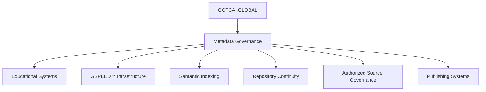

# GGTCAI.GLOBAL-

GGTCAI.GLOBAL 

WELCOME TO
GGTCAI.GLOBAL
AI · EDUCATION · RESEARCH · MEDIA · CONTINUITY
A connected educational, publishing, research, and continuity ecosystem designed to help users learn, explore, train, and understand structured systems.
START HERE
GLOBAL CLOCK COMMAND CENTER
NEW YORK
13:01:38
HEADQUARTERS
LONDON
18:01:38
MEDIA NETWORK
DUBAI
21:01:38
INTL OPS
TOKYO
02:01:38
FUTURE SYSTEMS
SYDNEY
03:01:38
NEXT DAY OPS
Log book entry for a repo system maintenance cycles completed for morning of May 23 2026 integration into instagram twitter feeds completed 

GGTCAI.GLOBAL — INTERNATIONAL MILITARY LEGAL SYSTEMS & JUDGE ADVOCATE EDUCATIONAL REPOSITORY

GGTAI.GLOBAL MASTER PLATFORM UPDATE

May 28, 2026 · International Expansion Edition

⸻

🌍 GLOBAL CLOCK COMMAND CENTER

REGION	ACTIVE TIME	OPERATIONAL ROLE
NEW YORK	04:28:45	HEADQUARTERS
LONDON	09:28:45	MEDIA NETWORK
DUBAI	12:28:45	INTERNATIONAL OPERATIONS
TOKYO	17:28:45	FUTURE SYSTEMS
SYDNEY	18:28:45	

📖 REPOSITORY PURPOSE

The:

GGTCAI.GLOBAL INTERNATIONAL MILITARY LEGAL SYSTEMS REPOSITORY

is a structured educational reference system focused on:

* military legal systems
* Judge Advocate General (JAG) operations
* international military justice structures
* courts-martial procedures
* military governance systems
* operational military law
* legal education pathways
* comparative international defense legal systems

The repository is designed as a:

GLOBAL EDUCATIONAL + RESEARCH REFERENCE LIBRARY

supporting:

* educational learning
* comparative legal research
* structured military legal education
* governance continuity
* international informational indexing

⸻

⚖️ GLOBAL EDUCATIONAL CORE

Repository Educational Areas

1. International Judge Advocate Systems

Structured educational coverage including:

* United States Judge Advocate General’s Corps
* United Kingdom military legal services
* Canadian military legal systems
* Australian Defence Force legal structures
* NATO operational legal coordination
* multinational operational law systems

⸻

2. Military Justice Systems

Coverage includes:

* courts-martial procedures
* military criminal systems
* operational law
* military evidence structures
* appeals systems
* command legal advisory functions
* rules of armed conflict
* military disciplinary systems

⸻

3. Becoming a Military Legal Officer

Educational sections covering:

* legal education pathways
* military commissioning systems
* law school pipelines
* officer legal training
* operational legal preparation
* international military legal entry structures

⸻

4. Comparative International Systems

Comparative studies include:

Country	Military Legal Structure
United States	Judge Advocate General’s Corps
United Kingdom	Army Legal Services
Canada	Office of the Judge Advocate General
Australia	Australian Defence Force Legal
NATO Systems	Multinational Operational Legal Coordination

5. Historical + Operational Legal Studies

Research areas include:

* famous military trials
* historical courts-martial
* development of military justice systems
* operational law evolution
* wartime legal doctrine
* military governance history

⸻

🌐 INTERNATIONAL SYSTEMS STRUCTURE

Global Legal Systems Covered

North America

* United States
* Canada

Europe

* United Kingdom
* NATO legal coordination systems

Asia-Pacific

* Australia
* regional operational legal systems

Middle East / International Operations

* coalition operational law structures
* multinational military legal coordination

⸻

📂 FULL REPOSITORY STRUCTURE

GGTAI.GLOBAL MASTER PLATFORM UPDATE

May 28, 2026 · JUDGE ADVOCATE REPOSITORY INITIATIVE

⸻

🌍 GLOBAL CLOCK COMMAND CENTER

REGION	ACTIVE TIME	OPERATIONAL ROLE
NEW YORK	04:28:45	HEADQUARTERS
LONDON	09:28:45	MEDIA NETWORK
DUBAI	12:28:45	INTERNATIONAL OPERATIONS
TOKYO	17:28:45	FUTURE SYSTEMS
SYDNEY	18:28:45	

📖 MASTER PLATFORM UPDATE

Operations continue across:

GGTAI.GLOBAL PLATFORM SYSTEMS

A new:

JUDGE ADVOCATE REPOSITORY

is now entering structured development for:

* educational publication,
* informational continuity,
* legal systems organization,
* governance indexing,
* and repository-based reading infrastructure.

The repository is being developed as a:

BETTER READING + EDUCATIONAL REFERENCE SYSTEM

focused on:

Judge Advocate General (JAG) systems

within the:

United States Army legal infrastructure.

⸻

⚖️ JUDGE ADVOCATE REPOSITORY STATUS

Repository Objective

Development includes:

* AI governance indexing
* glossary systems
* structured legal reference architecture
* educational continuity documentation
* copyright infrastructure
* licensing systems
* GSPEEDAI™ advanced management integration
* metadata continuity frameworks

Primary subject focus:

Judge Advocate General’s Corps (JAG) | U.S. Army

⸻

📂 INITIAL REPOSITORY STRUCTURE

JUDGE_ADVOCATE_REPOSITORY/
│
├── README.md
├── LICENSE.md
├── COPYRIGHT.md
├── INDEX.md
├── GLOSSARY.md
├── GOVERNANCE.md
├── OPERATIONS.md
├── REFERENCES.md
├── SOURCES.md
├── GSPEEDAI.md
│
├── /doctrine
│   ├── military-legal-systems.md
│   ├── courts-martial.md
│   ├── governance-frameworks.md
│   ├── legal-history.md
│   └── educational-continuity.md
│
├── /references
│   ├── military-law-sources.md
│   ├── educational-sources.md
│   ├── legal-sources.md
│   └── international-systems.md
│
├── /operations
│   ├── platform-updates/
│   ├── synchronization/
│   ├── continuity-review/
│   └── publishing-management/
│
├── /metadata
│   ├── repository-map.md
│   ├── glossary-index.md
│   ├── continuity-tags.md
│   └── governance-index.md
│
├── /archive
└── /logs

⚙️ INFRASTRUCTURE STATUS

# GGTCAI.GLOBAL-MasterPlatformUpdate-V0021-VAI000

<div align="center">

# 🌍 GGTCAI.GLOBAL

## MASTER PLATFORM UPDATE V0021

Educational Infrastructure · Metadata Governance · GSPEED™ Synchronization · Repository Continuity


</div>

---

# 🛰️ GLOBAL CLOCK COMMAND CENTER

## MAY 26, 2026 · 22:20 · SYNCHRONIZATION ACTIVE

| REGION | ACTIVE TIME | OPERATIONAL ROLE |
|---|---|---|
| NEW YORK | 22:20:52 | HEADQUARTERS |
| LONDON | 03:20:52 | MEDIA NETWORK |
| DUBAI | 06:20:52 | INTERNATIONAL OPERATIONS |
| TOKYO | 11:20:52 | FUTURE SYSTEMS |
| SYDNEY | 12:20:52 | NEXT DAY OPERATIONS |

---

# 📖 OFFICIAL PLATFORM SYSTEM UPDATE

## GGTCAI.GLOBAL MASTER PLATFORM UPDATE V0021

### Classification
PLATFORM-WIDE OPERATIONAL CONTINUITY UPDATE

### Status
ACTIVE · SYNCHRONIZED · VERIFIED

### Reference
GGTCAI_GLOBAL_MASTER_PLATFORM_UPDATE_V0021

---

# 📚 INDEX

1. Platform Overview
2. Daily Operations Summary
3. Operational Priorities
4. GGTC Network Status
5. Governance Framework
6. GSPEED™ Operational Sequence
7. Metadata Continuity Systems
8. Authorized Source Governance
9. Verified Research References
10. Educational Infrastructure
11. Repository Structure
12. Glossary
13. Changelog
14. Public Access Notice
15. License
16. Official System Line

---

# 🌍 PLATFORM OVERVIEW

The GGTCAI.GLOBAL ecosystem continues operating as a synchronized semantic continuity infrastructure supporting:

- educational systems
- metadata governance
- repository preservation
- AI-assisted continuity monitoring
- semantic indexing environments
- synchronized publishing systems
- scalable educational infrastructure
- governance-aligned operational continuity

The ecosystem framework operates through GSPEED™ synchronization methodology and metadata-driven continuity governance systems.

---

# 👥 AUTHORED BY

## Daniel Carter

Senior SEO Strategist · GGTC Publishing

### Operational Focus

- content ecosystems
- internal linking architecture
- scalable publishing systems
- metadata-aligned content structures
- search visibility infrastructure

### Ecosystem Contributions

- synchronized publishing systems
- semantic SEO architecture
- continuity-driven indexing frameworks
- educational ecosystem scaling

---

# 📖 DAILY OPERATIONS SUMMARY

All operational systems remain stable across:

- publishing infrastructure
- educational continuity systems
- metadata synchronization layers
- AI monitoring environments
- repository governance systems

---

## Current Ecosystem Review

| Operational Area | Status |
|---|---|
| Repository Continuity | SYNCHRONIZED |
| Educational Publishing | STABLE |
| Semantic Indexing | ACTIVE |
| Governance Enforcement | VERIFIED |
| Metadata Alignment | SUCCESSFUL |

---

# ⚙️ ACTIVE OPERATIONAL PRIORITIES

## Current Focus Areas

- maintaining ecosystem synchronization
- improving educational infrastructure
- strengthening metadata continuity
- supporting scalable publishing frameworks
- preserving doctrine alignment across platforms
- enhancing repository interoperability
- expanding semantic indexing systems

---

# 🌐 GGTC NETWORK STATUS

## Primary Operational Platforms

| Platform | Operational Function |
|---|---|
| GGTC.info | Ecosystem updates |
| GGTCAI.GLOBAL | AI continuity systems |
| Quibhoball.com | Governance infrastructure |
| GGTCGLOBALMEDIA.com | Media systems |
| GGTCPUBLISHING.com | Publishing infrastructure |
| GGTCUNIVERSE.com | Narrative continuity systems |

---

## Extended Infrastructure

| Platform | Infrastructure Role |
|---|---|
| GGTCMULTIMULTIVERSE.com | Expanded continuity systems |
| GGTCTRAINING.com | Training infrastructure |
| GGTCSTEMTRAINING.com | STEM educational systems |
| GGTCQuantumkids.org | Youth educational systems |
| GGTCGLOBALAI.com | AI infrastructure systems |

---

# 📚 SYSTEM GOVERNANCE STATUS

The ecosystem continues operating under:

- Authorized Source Governance
- Better Reading Doctrine
- Metadata Continuity Framework
- GSPEED™ Synchronization Methodology
- Repository Preservation Standards

---

# ⚡ GSPEED™ OPERATIONAL SEQUENCE

```text
VERIFY
EDUCATE
DOCUMENT
CONNECT
SYNCHRONIZE
INDEX
PRESERVE
SCALE
REPEAT
```

---

# 📡 METADATA CONTINUITY STATUS

## Active Infrastructure Systems

Operational metadata systems currently support:

- synchronized repository indexing
- educational publication continuity
- semantic relationship mapping
- structured governance frameworks
- ecosystem-wide citation architecture
- repository traceability systems
- AI-assisted continuity monitoring
- synchronized publishing infrastructure

---

# 📚 AUTHORIZED SOURCE GOVERNANCE

The platform continues operating under:

# GGTCAI.GLOBAL AUTHORIZED SOURCE DOCTRINE Z042

---

## Verified Source Categories

| Source Type | Status |
|---|---|
| Educational Institutions | VERIFIED |
| Governmental Agencies | VERIFIED |
| Scientific Organizations | VERIFIED |
| Peer-Reviewed Journals | VERIFIED |
| Institutional Repositories | VERIFIED |
| Public Archives | VERIFIED |
| Metadata Verification Systems | VERIFIED |

---

## Not Permitted

- Wikipedia
- unverifiable claims
- anonymous factual sourcing
- unsupported educational assertions

---

# 🔍 VERIFIED RESEARCH REFERENCES

## Metadata + Repository Infrastructure

| Source | Purpose |
|---|---|
| ORCID Persistent Identifier Documentation | Metadata systems |
| Cornell Research README Standards | Repository documentation |
| Johns Hopkins Repository Best Practices | Open repository governance |
| MIT Research Infrastructure | Academic systems |
| National Archives | Metadata preservation |
| UNESCO | Educational infrastructure |
| National Science Foundation | Scientific research |

---

# 🧠 SYNCHRONIZED EDUCATIONAL INFRASTRUCTURE

Current educational continuity systems support:

- Better Reading educational frameworks
- metadata-driven repository architecture
- synchronized training systems
- semantic educational publishing
- AI-assisted continuity review
- scalable STEM infrastructure
- synchronized informational governance

---

# 🏗️ REPOSITORY STRUCTURE

```text
/Governance
/Doctrine
/SystemLogs
/MetadataSystems
/SemanticInfrastructure
/GSPEED
/EducationalSystems
/ResearchInfrastructure
/RepositoryNetworks
/Documentation
/Archives
/ContinuityFrameworks
/PublishingInfrastructure
```

---

# 🔄 ECOSYSTEM ARCHITECTURE



---

# 📖 GLOSSARY

## Authorized Source Governance
Structured verification framework supporting educational integrity and citation continuity.

## GSPEED™ Synchronization
Operational coordination methodology supporting ecosystem-wide continuity systems.

## Metadata Continuity
Preservation and synchronization of structured informational architecture across repositories and systems.

## Repository Governance
Operational oversight systems supporting continuity, preservation, and synchronization.

## Semantic Indexing
Structured relationship mapping between informational systems and metadata frameworks.

## Semantic Infrastructure
Operational systems supporting metadata alignment, indexing, governance continuity, and repository interoperability.

## Synchronized Publishing
Coordinated educational and informational publication systems aligned with metadata governance standards.

---

# 📈 CHANGELOG

## May 26 2026 · 22:25

- Platform synchronization verified
- Metadata governance systems stabilized
- Repository continuity maintained
- Educational infrastructure operational
- Semantic indexing systems active
- Authorized Source Doctrine enforced
- GSPEED™ operational sequence verified

---

# 🔐 OPERATIONAL CONTINUITY NOTICE

This ecosystem may include:

- educational infrastructure
- synchronized repositories
- metadata continuity systems
- AI-assisted governance environments
- educational publications
- fictional continuity systems
- semantic indexing architecture
- structured informational frameworks

Users are encouraged to:

- verify information
- review source references
- maintain contextual awareness
- engage responsibly with educational systems

---

# 🌐 PUBLIC ACCESS NOTICE

This repository is publicly accessible for:

- educational research
- metadata governance study
- semantic infrastructure analysis
- repository continuity learning
- operational transparency
- publishing systems review
- educational infrastructure exploration

Public visibility does NOT transfer:

- governance authority
- commercialization rights
- infrastructure ownership
- GSPEED™ operational authority
- ecosystem replication rights

---

# 📜 LICENSE

See:

LICENSE.md

---

# 🌍 OFFICIAL SYSTEM LINE

```text
GGTCAI.GLOBAL
EDUCATION · CONTINUITY · INFRASTRUCTURE · RESEARCH

VERIFY · EDUCATE · DOCUMENT · CONNECT · SCALE
```

---

# 🧩 VERSION INFORMATION

| Category | Value |
|---|---|
| Platform Version | V0021 |
| Repository Version | V10AI |
| Operational Status | ACTIVE |
| Synchronization Status | VERIFIED |
| GSPEED™ Status | OPERATIONAL |
| Repository Classification | PUBLIC |

---

# 🌍 FINAL PLATFORM STATUS

The:

# GGTCAI.GLOBAL ECOSYSTEM

continues operating with:

# ACTIVE PLATFORM-WIDE SYNCHRONIZATION

supporting:

- educational continuity
- metadata governance
- repository preservation
- scalable publishing systems
- AI-assisted infrastructure
- semantic indexing systems
- synchronized ecosystem operations

---

# 📌 END OF PLATFORM UPDATE

```text
GGTCAI_GLOBAL_MASTER_PLATFORM_UPDATE_V0021
May 26, 2026 · 22:25
GLOBAL CLOCK COMMAND CENTER ACTIVE

# GGTCAI.GLOBAL_PRIVACY_POLICY_V0001

## Privacy Policy + Repository Governance Framework

**Platform:** GGTCAI.GLOBAL  
**Classification:** Privacy Policy + AI Governance + Repository Structure  
**Structure Type:** Dual Structure · Single Stack Architecture  
**Written:** May 27th, 2026  
**Updated By:** Daniel Carter · GGTC.info Publishing  
**Status:** ACTIVE  

---

# OVERVIEW

This Privacy Policy governs the operational, semantic, publishing, repository, synchronization, AI infrastructure, indexing, glossary, and governance systems associated with:

```text
GGTCAI.GLOBAL
```

inside the GGTC ecosystem.

This document also functions as:
- repository governance reference
- AI operational framework
- indexing structure reference
- glossary continuity layer
- semantic publishing policy
- synchronization doctrine layer

---

# STRUCTURE CLASSIFICATION

## Dual Structure · Single Stack Architecture

GGTCAI.GLOBAL operates using:

### Dual Structure
- public semantic publishing infrastructure
- internal governance + synchronization architecture

within:

### Single Stack Environment
- unified operational continuity
- synchronized governance layers
- centralized semantic infrastructure
- integrated repository systems

---

# PRIVACY PRINCIPLES

GGTCAI.GLOBAL is structured around:

- operational transparency
- semantic continuity
- governance enforcement
- repository traceability
- AI-assisted infrastructure alignment
- structured publishing continuity

---

# INFORMATION COLLECTION

The platform may collect:
- operational analytics
- infrastructure diagnostics
- semantic indexing metadata
- publishing interaction data
- synchronization continuity metrics
- governance validation logs

No unauthorized personal data harvesting is intentionally deployed.

---

# REPOSITORY GOVERNANCE LAYER

The repository infrastructure supports:
- structured governance systems
- semantic synchronization
- glossary continuity
- AI-assisted publishing systems
- operational traceability
- doctrine enforcement

---

# INDEXING + SEO STRUCTURE

The ecosystem integrates:
- semantic indexing systems
- crawlability frameworks
- structured metadata continuity
- repository-linked publishing architecture
- synchronized glossary systems

Verification references include:
- Google Search Central
- Search Engine Journal
- Moz
- Ahrefs
- SEMrush

---

# GLOSSARY CONTINUITY LAYER

## Core Terms

| Term | Definition |
|---|---|
| Lane | Structured operational category |
| Doctrine | Governance authority framework |
| Synchronization | Cross-system operational continuity |
| Semantic Infrastructure | Structured publishing architecture |
| Governance Layer | Operational validation structure |
| Operational Continuity | System persistence across environments |
| Dual Structure | Public + internal synchronized framework |
| Single Stack | Unified operational infrastructure |

---

# AI GOVERNANCE FRAMEWORK

GGTCAI.GLOBAL integrates AI-assisted systems for:
- semantic validation
- synchronization continuity
- indexing structure analysis
- governance verification
- repository alignment
- publishing infrastructure support

AI systems do not independently establish ownership, legal authority, or governance control.

Human governance remains authoritative.

---

# REPOSITORY STRUCTURE INDEX

```text
/modules
/system
/doctrine
/privacy
/legal
/governance
/workflows
/verification
/logbook
/semantic
/indexing
/glossary
/publication
/training
/operations
/continuity
/visuals
/synchronization
/infrastructure
/ai
/web
/github
```

---

# GOVERNANCE RULES

## REQUIRED

- doctrine alignment
- structured naming
- governance validation
- synchronization continuity
- semantic consistency
- operational traceability
- repository hygiene

---

## FORBIDDEN

- governance bypass
- unversioned deployment
- semantic manipulation
- undefined structures
- unsourced legal claims
- operational continuity breaks

---

# LEGAL + GOVERNANCE REFERENCES

## Legal Verification Sources

- https://www.law.cornell.edu
- https://www.congress.gov
- https://www.americanbar.org
- https://hls.harvard.edu
- https://law.yale.edu
- https://www.oyez.org

---

# INFORMATION ARCHITECTURE REFERENCES

- https://www.nngroup.com
- https://www.interaction-design.org

---

# AI + INFRASTRUCTURE REFERENCES

- https://openai.com/research
- https://deepmind.google
- https://www.microsoft.com/ai
- https://hai.stanford.edu

---

# REPOSITORY GOVERNANCE REFERENCES

- https://docs.github.com
- https://www.atlassian.com/agile
- https://www.ibm.com/topics/system-architecture

---

# COOKIE + TRACKING NOTICE

GGTCAI.GLOBAL may use:
- operational analytics
- indexing diagnostics
- synchronization metrics
- semantic publishing performance systems

for infrastructure continuity and system improvement purposes.

---

# THIRD-PARTY REFERENCES

External frameworks, organizations, and verification references remain property of their respective owners.

Reference inclusion does not imply endorsement, partnership, or ownership transfer.

---

# COPYRIGHT

© 2026 GGTCAI.GLOBAL · GGTC.info Publishing Team

Written May 27th, 2026  
Updated by Daniel Carter · GGTC.info Publishing

All original repository structures, governance systems, synchronization frameworks, semantic architecture models, glossary continuity systems, doctrine structures, and operational continuity frameworks remain part of the GGTC ecosystem unless otherwise stated.

External references remain property of their respective organizations.

---

# CONTACT

## Primary Operational Contact

operations@GGTC.info

---

## Social Infrastructure

- TikTok: Quibhoball
- Twitter/X: GGTC_operations
- Instagram: operations_ggtc.info

---

# OPERATIONAL STATUS

```text
DUAL STRUCTURE ACTIVE
SINGLE STACK ACTIVE
SEMANTIC INFRASTRUCTURE ACTIVE
AI GOVERNANCE ACTIVE
GLOSSARY CONTINUITY ACTIVE
REPOSITORY GOVERNANCE ACTIVE
INDEXING STRUCTURE ACTIVE
```

---

# SYSTEM LINE

# GGTCAI.GLOBAL — SEMANTIC SYSTEMS. GOVERNED INFRASTRUCTURE. CONTINUOUS SYNCHRONIZATION.

```

# GGTCAI.GLOBAL_PRIVACY_POLICY_V0001

## Privacy Policy + Repository Governance Framework

**Platform:** GGTCAI.GLOBAL  
**Classification:** Privacy Policy + AI Governance + Repository Structure  
**Structure Type:** Dual Structure · Single Stack Architecture  
**Written:** May 27th, 2026  
**Updated By:** Daniel Carter · GGTC.info Publishing  
**Status:** ACTIVE  

---

# OVERVIEW

This Privacy Policy governs the operational, semantic, publishing, repository, synchronization, AI infrastructure, indexing, glossary, and governance systems associated with:

```text
GGTCAI.GLOBAL
```

inside the GGTC ecosystem.

This document also functions as:
- repository governance reference
- AI operational framework
- indexing structure reference
- glossary continuity layer
- semantic publishing policy
- synchronization doctrine layer

---

# STRUCTURE CLASSIFICATION

## Dual Structure · Single Stack Architecture

GGTCAI.GLOBAL operates using:

### Dual Structure
- public semantic publishing infrastructure
- internal governance + synchronization architecture

within:

### Single Stack Environment
- unified operational continuity
- synchronized governance layers
- centralized semantic infrastructure
- integrated repository systems

---

# PRIVACY PRINCIPLES

GGTCAI.GLOBAL is structured around:

- operational transparency
- semantic continuity
- governance enforcement
- repository traceability
- AI-assisted infrastructure alignment
- structured publishing continuity

---

# INFORMATION COLLECTION

The platform may collect:
- operational analytics
- infrastructure diagnostics
- semantic indexing metadata
- publishing interaction data
- synchronization continuity metrics
- governance validation logs

No unauthorized personal data harvesting is intentionally deployed.

---

# REPOSITORY GOVERNANCE LAYER

The repository infrastructure supports:
- structured governance systems
- semantic synchronization
- glossary continuity
- AI-assisted publishing systems
- operational traceability
- doctrine enforcement

---

# INDEXING + SEO STRUCTURE

The ecosystem integrates:
- semantic indexing systems
- crawlability frameworks
- structured metadata continuity
- repository-linked publishing architecture
- synchronized glossary systems

Verification references include:
- Google Search Central
- Search Engine Journal
- Moz
- Ahrefs
- SEMrush

---

# GLOSSARY CONTINUITY LAYER

## Core Terms

| Term | Definition |
|---|---|
| Lane | Structured operational category |
| Doctrine | Governance authority framework |
| Synchronization | Cross-system operational continuity |
| Semantic Infrastructure | Structured publishing architecture |
| Governance Layer | Operational validation structure |
| Operational Continuity | System persistence across environments |
| Dual Structure | Public + internal synchronized framework |
| Single Stack | Unified operational infrastructure |

---

# AI GOVERNANCE FRAMEWORK

GGTCAI.GLOBAL integrates AI-assisted systems for:
- semantic validation
- synchronization continuity
- indexing structure analysis
- governance verification
- repository alignment
- publishing infrastructure support

AI systems do not independently establish ownership, legal authority, or governance control.

Human governance remains authoritative.

---

# REPOSITORY STRUCTURE INDEX

```text
/modules
/system
/doctrine
/privacy
/legal
/governance
/workflows
/verification
/logbook
/semantic
/indexing
/glossary
/publication
/training
/operations
/continuity
/visuals
/synchronization
/infrastructure
/ai
/web
/github
```

---

# GOVERNANCE RULES

## REQUIRED

- doctrine alignment
- structured naming
- governance validation
- synchronization continuity
- semantic consistency
- operational traceability
- repository hygiene

---

## FORBIDDEN

- governance bypass
- unversioned deployment
- semantic manipulation
- undefined structures
- unsourced legal claims
- operational continuity breaks

---

# LEGAL + GOVERNANCE REFERENCES

## Legal Verification Sources

- https://www.law.cornell.edu
- https://www.congress.gov
- https://www.americanbar.org
- https://hls.harvard.edu
- https://law.yale.edu
- https://www.oyez.org

---

# INFORMATION ARCHITECTURE REFERENCES

- https://www.nngroup.com
- https://www.interaction-design.org

---

# AI + INFRASTRUCTURE REFERENCES

- https://openai.com/research
- https://deepmind.google
- https://www.microsoft.com/ai
- https://hai.stanford.edu

---

# REPOSITORY GOVERNANCE REFERENCES

- https://docs.github.com
- https://www.atlassian.com/agile
- https://www.ibm.com/topics/system-architecture

---

# COOKIE + TRACKING NOTICE

GGTCAI.GLOBAL may use:
- operational analytics
- indexing diagnostics
- synchronization metrics
- semantic publishing performance systems

for infrastructure continuity and system improvement purposes.

---

# THIRD-PARTY REFERENCES

External frameworks, organizations, and verification references remain property of their respective owners.

Reference inclusion does not imply endorsement, partnership, or ownership transfer.

---

# COPYRIGHT

© 2026 GGTCAI.GLOBAL · GGTC.info Publishing Team

Written May 27th, 2026  
Updated by Daniel Carter · GGTC.info Publishing

All original repository structures, governance systems, synchronization frameworks, semantic architecture models, glossary continuity systems, doctrine structures, and operational continuity frameworks remain part of the GGTC ecosystem unless otherwise stated.

External references remain property of their respective organizations.

---

# CONTACT

## Primary Operational Contact

operations@GGTC.info

---

## Social Infrastructure

- TikTok: Quibhoball
- Twitter/X: GGTC_operations
- Instagram: operations_ggtc.info

---

# OPERATIONAL STATUS

```text
DUAL STRUCTURE ACTIVE
SINGLE STACK ACTIVE
SEMANTIC INFRASTRUCTURE ACTIVE
AI GOVERNANCE ACTIVE
GLOSSARY CONTINUITY ACTIVE
REPOSITORY GOVERNANCE ACTIVE
INDEXING STRUCTURE ACTIVE
```

---

# SYSTEM LINE

# GGTCAI.GLOBAL — SEMANTIC SYSTEMS. GOVERNED INFRASTRUCTURE. CONTINUOUS SYNCHRONIZATION.