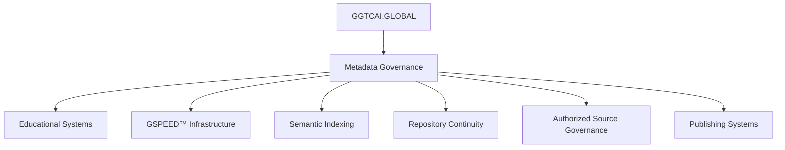

# GGTCAI.GLOBAL-

GGTCAI.GLOBAL 

WELCOME TO
GGTCAI.GLOBAL
AI · EDUCATION · RESEARCH · MEDIA · CONTINUITY
A connected educational, publishing, research, and continuity ecosystem designed to help users learn, explore, train, and understand structured systems.
START HERE
GLOBAL CLOCK COMMAND CENTER
NEW YORK
13:01:38
HEADQUARTERS
LONDON
18:01:38
MEDIA NETWORK
DUBAI
21:01:38
INTL OPS
TOKYO
02:01:38
FUTURE SYSTEMS
SYDNEY
03:01:38
NEXT DAY OPS
Log book entry for a repo system maintenance cycles completed for morning of May 23 2026 integration into instagram twitter feeds completed 

GGTCAI.GLOBAL — INTERNATIONAL MILITARY LEGAL SYSTEMS & JUDGE ADVOCATE EDUCATIONAL REPOSITORY

GGTAI.GLOBAL MASTER PLATFORM UPDATE

May 28, 2026 · International Expansion Edition

⸻

🌍 GLOBAL CLOCK COMMAND CENTER

REGION	ACTIVE TIME	OPERATIONAL ROLE
NEW YORK	04:28:45	HEADQUARTERS
LONDON	09:28:45	MEDIA NETWORK
DUBAI	12:28:45	INTERNATIONAL OPERATIONS
TOKYO	17:28:45	FUTURE SYSTEMS
SYDNEY	18:28:45	

📖 REPOSITORY PURPOSE

The:

GGTCAI.GLOBAL INTERNATIONAL MILITARY LEGAL SYSTEMS REPOSITORY

is a structured educational reference system focused on:

* military legal systems
* Judge Advocate General (JAG) operations
* international military justice structures
* courts-martial procedures
* military governance systems
* operational military law
* legal education pathways
* comparative international defense legal systems

The repository is designed as a:

GLOBAL EDUCATIONAL + RESEARCH REFERENCE LIBRARY

supporting:

* educational learning
* comparative legal research
* structured military legal education
* governance continuity
* international informational indexing

⸻

⚖️ GLOBAL EDUCATIONAL CORE

Repository Educational Areas

1. International Judge Advocate Systems

Structured educational coverage including:

* United States Judge Advocate General’s Corps
* United Kingdom military legal services
* Canadian military legal systems
* Australian Defence Force legal structures
* NATO operational legal coordination
* multinational operational law systems

⸻

2. Military Justice Systems

Coverage includes:

* courts-martial procedures
* military criminal systems
* operational law
* military evidence structures
* appeals systems
* command legal advisory functions
* rules of armed conflict
* military disciplinary systems

⸻

3. Becoming a Military Legal Officer

Educational sections covering:

* legal education pathways
* military commissioning systems
* law school pipelines
* officer legal training
* operational legal preparation
* international military legal entry structures

⸻

4. Comparative International Systems

Comparative studies include:

Country	Military Legal Structure
United States	Judge Advocate General’s Corps
United Kingdom	Army Legal Services
Canada	Office of the Judge Advocate General
Australia	Australian Defence Force Legal
NATO Systems	Multinational Operational Legal Coordination

5. Historical + Operational Legal Studies

Research areas include:

* famous military trials
* historical courts-martial
* development of military justice systems
* operational law evolution
* wartime legal doctrine
* military governance history

⸻

🌐 INTERNATIONAL SYSTEMS STRUCTURE

Global Legal Systems Covered

North America

* United States
* Canada

Europe

* United Kingdom
* NATO legal coordination systems

Asia-Pacific

* Australia
* regional operational legal systems

Middle East / International Operations

* coalition operational law structures
* multinational military legal coordination

⸻

📂 FULL REPOSITORY STRUCTURE

GGTAI.GLOBAL MASTER PLATFORM UPDATE

May 28, 2026 · JUDGE ADVOCATE REPOSITORY INITIATIVE

⸻

🌍 GLOBAL CLOCK COMMAND CENTER

REGION	ACTIVE TIME	OPERATIONAL ROLE
NEW YORK	04:28:45	HEADQUARTERS
LONDON	09:28:45	MEDIA NETWORK
DUBAI	12:28:45	INTERNATIONAL OPERATIONS
TOKYO	17:28:45	FUTURE SYSTEMS
SYDNEY	18:28:45	

📖 MASTER PLATFORM UPDATE

Operations continue across:

GGTAI.GLOBAL PLATFORM SYSTEMS

A new:

JUDGE ADVOCATE REPOSITORY

is now entering structured development for:

* educational publication,
* informational continuity,
* legal systems organization,
* governance indexing,
* and repository-based reading infrastructure.

The repository is being developed as a:

BETTER READING + EDUCATIONAL REFERENCE SYSTEM

focused on:

Judge Advocate General (JAG) systems

within the:

United States Army legal infrastructure.

⸻

⚖️ JUDGE ADVOCATE REPOSITORY STATUS

Repository Objective

Development includes:

* AI governance indexing
* glossary systems
* structured legal reference architecture
* educational continuity documentation
* copyright infrastructure
* licensing systems
* GSPEEDAI™ advanced management integration
* metadata continuity frameworks

Primary subject focus:

Judge Advocate General’s Corps (JAG) | U.S. Army

⸻

📂 INITIAL REPOSITORY STRUCTURE

JUDGE_ADVOCATE_REPOSITORY/
│
├── README.md
├── LICENSE.md
├── COPYRIGHT.md
├── INDEX.md
├── GLOSSARY.md
├── GOVERNANCE.md
├── OPERATIONS.md
├── REFERENCES.md
├── SOURCES.md
├── GSPEEDAI.md
│
├── /doctrine
│   ├── military-legal-systems.md
│   ├── courts-martial.md
│   ├── governance-frameworks.md
│   ├── legal-history.md
│   └── educational-continuity.md
│
├── /references
│   ├── military-law-sources.md
│   ├── educational-sources.md
│   ├── legal-sources.md
│   └── international-systems.md
│
├── /operations
│   ├── platform-updates/
│   ├── synchronization/
│   ├── continuity-review/
│   └── publishing-management/
│
├── /metadata
│   ├── repository-map.md
│   ├── glossary-index.md
│   ├── continuity-tags.md
│   └── governance-index.md
│
├── /archive
└── /logs

⚙️ INFRASTRUCTURE STATUS

# GGTCAI.GLOBAL-MasterPlatformUpdate-V0021-VAI000

<div align="center">

# 🌍 GGTCAI.GLOBAL

## MASTER PLATFORM UPDATE V0021

Educational Infrastructure · Metadata Governance · GSPEED™ Synchronization · Repository Continuity


</div>

---

# 🛰️ GLOBAL CLOCK COMMAND CENTER

## MAY 26, 2026 · 22:20 · SYNCHRONIZATION ACTIVE

| REGION | ACTIVE TIME | OPERATIONAL ROLE |
|---|---|---|
| NEW YORK | 22:20:52 | HEADQUARTERS |
| LONDON | 03:20:52 | MEDIA NETWORK |
| DUBAI | 06:20:52 | INTERNATIONAL OPERATIONS |
| TOKYO | 11:20:52 | FUTURE SYSTEMS |
| SYDNEY | 12:20:52 | NEXT DAY OPERATIONS |

---

# 📖 OFFICIAL PLATFORM SYSTEM UPDATE

## GGTCAI.GLOBAL MASTER PLATFORM UPDATE V0021

### Classification
PLATFORM-WIDE OPERATIONAL CONTINUITY UPDATE

### Status
ACTIVE · SYNCHRONIZED · VERIFIED

### Reference
GGTCAI_GLOBAL_MASTER_PLATFORM_UPDATE_V0021

---

# 📚 INDEX

1. Platform Overview
2. Daily Operations Summary
3. Operational Priorities
4. GGTC Network Status
5. Governance Framework
6. GSPEED™ Operational Sequence
7. Metadata Continuity Systems
8. Authorized Source Governance
9. Verified Research References
10. Educational Infrastructure
11. Repository Structure
12. Glossary
13. Changelog
14. Public Access Notice
15. License
16. Official System Line

---

# 🌍 PLATFORM OVERVIEW

The GGTCAI.GLOBAL ecosystem continues operating as a synchronized semantic continuity infrastructure supporting:

- educational systems
- metadata governance
- repository preservation
- AI-assisted continuity monitoring
- semantic indexing environments
- synchronized publishing systems
- scalable educational infrastructure
- governance-aligned operational continuity

The ecosystem framework operates through GSPEED™ synchronization methodology and metadata-driven continuity governance systems.

---

# 👥 AUTHORED BY

## Daniel Carter

Senior SEO Strategist · GGTC Publishing

### Operational Focus

- content ecosystems
- internal linking architecture
- scalable publishing systems
- metadata-aligned content structures
- search visibility infrastructure

### Ecosystem Contributions

- synchronized publishing systems
- semantic SEO architecture
- continuity-driven indexing frameworks
- educational ecosystem scaling

---

# 📖 DAILY OPERATIONS SUMMARY

All operational systems remain stable across:

- publishing infrastructure
- educational continuity systems
- metadata synchronization layers
- AI monitoring environments
- repository governance systems

---

## Current Ecosystem Review

| Operational Area | Status |
|---|---|
| Repository Continuity | SYNCHRONIZED |
| Educational Publishing | STABLE |
| Semantic Indexing | ACTIVE |
| Governance Enforcement | VERIFIED |
| Metadata Alignment | SUCCESSFUL |

---

# ⚙️ ACTIVE OPERATIONAL PRIORITIES

## Current Focus Areas

- maintaining ecosystem synchronization
- improving educational infrastructure
- strengthening metadata continuity
- supporting scalable publishing frameworks
- preserving doctrine alignment across platforms
- enhancing repository interoperability
- expanding semantic indexing systems

---

# 🌐 GGTC NETWORK STATUS

## Primary Operational Platforms

| Platform | Operational Function |
|---|---|
| GGTC.info | Ecosystem updates |
| GGTCAI.GLOBAL | AI continuity systems |
| Quibhoball.com | Governance infrastructure |
| GGTCGLOBALMEDIA.com | Media systems |
| GGTCPUBLISHING.com | Publishing infrastructure |
| GGTCUNIVERSE.com | Narrative continuity systems |

---

## Extended Infrastructure

| Platform | Infrastructure Role |
|---|---|
| GGTCMULTIMULTIVERSE.com | Expanded continuity systems |
| GGTCTRAINING.com | Training infrastructure |
| GGTCSTEMTRAINING.com | STEM educational systems |
| GGTCQuantumkids.org | Youth educational systems |
| GGTCGLOBALAI.com | AI infrastructure systems |

---

# 📚 SYSTEM GOVERNANCE STATUS

The ecosystem continues operating under:

- Authorized Source Governance
- Better Reading Doctrine
- Metadata Continuity Framework
- GSPEED™ Synchronization Methodology
- Repository Preservation Standards

---

# ⚡ GSPEED™ OPERATIONAL SEQUENCE

```text
VERIFY
EDUCATE
DOCUMENT
CONNECT
SYNCHRONIZE
INDEX
PRESERVE
SCALE
REPEAT
```

---

# 📡 METADATA CONTINUITY STATUS

## Active Infrastructure Systems

Operational metadata systems currently support:

- synchronized repository indexing
- educational publication continuity
- semantic relationship mapping
- structured governance frameworks
- ecosystem-wide citation architecture
- repository traceability systems
- AI-assisted continuity monitoring
- synchronized publishing infrastructure

---

# 📚 AUTHORIZED SOURCE GOVERNANCE

The platform continues operating under:

# GGTCAI.GLOBAL AUTHORIZED SOURCE DOCTRINE Z042

---

## Verified Source Categories

| Source Type | Status |
|---|---|
| Educational Institutions | VERIFIED |
| Governmental Agencies | VERIFIED |
| Scientific Organizations | VERIFIED |
| Peer-Reviewed Journals | VERIFIED |
| Institutional Repositories | VERIFIED |
| Public Archives | VERIFIED |
| Metadata Verification Systems | VERIFIED |

---

## Not Permitted

- Wikipedia
- unverifiable claims
- anonymous factual sourcing
- unsupported educational assertions

---

# 🔍 VERIFIED RESEARCH REFERENCES

## Metadata + Repository Infrastructure

| Source | Purpose |
|---|---|
| ORCID Persistent Identifier Documentation | Metadata systems |
| Cornell Research README Standards | Repository documentation |
| Johns Hopkins Repository Best Practices | Open repository governance |
| MIT Research Infrastructure | Academic systems |
| National Archives | Metadata preservation |
| UNESCO | Educational infrastructure |
| National Science Foundation | Scientific research |

---

# 🧠 SYNCHRONIZED EDUCATIONAL INFRASTRUCTURE

Current educational continuity systems support:

- Better Reading educational frameworks
- metadata-driven repository architecture
- synchronized training systems
- semantic educational publishing
- AI-assisted continuity review
- scalable STEM infrastructure
- synchronized informational governance

---

# 🏗️ REPOSITORY STRUCTURE

```text
/Governance
/Doctrine
/SystemLogs
/MetadataSystems
/SemanticInfrastructure
/GSPEED
/EducationalSystems
/ResearchInfrastructure
/RepositoryNetworks
/Documentation
/Archives
/ContinuityFrameworks
/PublishingInfrastructure
```

---

# 🔄 ECOSYSTEM ARCHITECTURE



---

# 📖 GLOSSARY

## Authorized Source Governance
Structured verification framework supporting educational integrity and citation continuity.

## GSPEED™ Synchronization
Operational coordination methodology supporting ecosystem-wide continuity systems.

## Metadata Continuity
Preservation and synchronization of structured informational architecture across repositories and systems.

## Repository Governance
Operational oversight systems supporting continuity, preservation, and synchronization.

## Semantic Indexing
Structured relationship mapping between informational systems and metadata frameworks.

## Semantic Infrastructure
Operational systems supporting metadata alignment, indexing, governance continuity, and repository interoperability.

## Synchronized Publishing
Coordinated educational and informational publication systems aligned with metadata governance standards.

---

# 📈 CHANGELOG

## May 26 2026 · 22:25

- Platform synchronization verified
- Metadata governance systems stabilized
- Repository continuity maintained
- Educational infrastructure operational
- Semantic indexing systems active
- Authorized Source Doctrine enforced
- GSPEED™ operational sequence verified

---

# 🔐 OPERATIONAL CONTINUITY NOTICE

This ecosystem may include:

- educational infrastructure
- synchronized repositories
- metadata continuity systems
- AI-assisted governance environments
- educational publications
- fictional continuity systems
- semantic indexing architecture
- structured informational frameworks

Users are encouraged to:

- verify information
- review source references
- maintain contextual awareness
- engage responsibly with educational systems

---

# 🌐 PUBLIC ACCESS NOTICE

This repository is publicly accessible for:

- educational research
- metadata governance study
- semantic infrastructure analysis
- repository continuity learning
- operational transparency
- publishing systems review
- educational infrastructure exploration

Public visibility does NOT transfer:

- governance authority
- commercialization rights
- infrastructure ownership
- GSPEED™ operational authority
- ecosystem replication rights

---

# 📜 LICENSE

See:

LICENSE.md

---

# 🌍 OFFICIAL SYSTEM LINE

```text
GGTCAI.GLOBAL
EDUCATION · CONTINUITY · INFRASTRUCTURE · RESEARCH

VERIFY · EDUCATE · DOCUMENT · CONNECT · SCALE
```

---

# 🧩 VERSION INFORMATION

| Category | Value |
|---|---|
| Platform Version | V0021 |
| Repository Version | V10AI |
| Operational Status | ACTIVE |
| Synchronization Status | VERIFIED |
| GSPEED™ Status | OPERATIONAL |
| Repository Classification | PUBLIC |

---

# 🌍 FINAL PLATFORM STATUS

The:

# GGTCAI.GLOBAL ECOSYSTEM

continues operating with:

# ACTIVE PLATFORM-WIDE SYNCHRONIZATION

supporting:

- educational continuity
- metadata governance
- repository preservation
- scalable publishing systems
- AI-assisted infrastructure
- semantic indexing systems
- synchronized ecosystem operations

---

# 📌 END OF PLATFORM UPDATE

```text
GGTCAI_GLOBAL_MASTER_PLATFORM_UPDATE_V0021
May 26, 2026 · 22:25
GLOBAL CLOCK COMMAND CENTER ACTIVE

# GGTCAI.GLOBAL_PRIVACY_POLICY_V0001

## Privacy Policy + Repository Governance Framework

**Platform:** GGTCAI.GLOBAL  
**Classification:** Privacy Policy + AI Governance + Repository Structure  
**Structure Type:** Dual Structure · Single Stack Architecture  
**Written:** May 27th, 2026  
**Updated By:** Daniel Carter · GGTC.info Publishing  
**Status:** ACTIVE  

---

# OVERVIEW

This Privacy Policy governs the operational, semantic, publishing, repository, synchronization, AI infrastructure, indexing, glossary, and governance systems associated with:

```text
GGTCAI.GLOBAL
```

inside the GGTC ecosystem.

This document also functions as:
- repository governance reference
- AI operational framework
- indexing structure reference
- glossary continuity layer
- semantic publishing policy
- synchronization doctrine layer

---

# STRUCTURE CLASSIFICATION

## Dual Structure · Single Stack Architecture

GGTCAI.GLOBAL operates using:

### Dual Structure
- public semantic publishing infrastructure
- internal governance + synchronization architecture

within:

### Single Stack Environment
- unified operational continuity
- synchronized governance layers
- centralized semantic infrastructure
- integrated repository systems

---

# PRIVACY PRINCIPLES

GGTCAI.GLOBAL is structured around:

- operational transparency
- semantic continuity
- governance enforcement
- repository traceability
- AI-assisted infrastructure alignment
- structured publishing continuity

---

# INFORMATION COLLECTION

The platform may collect:
- operational analytics
- infrastructure diagnostics
- semantic indexing metadata
- publishing interaction data
- synchronization continuity metrics
- governance validation logs

No unauthorized personal data harvesting is intentionally deployed.

---

# REPOSITORY GOVERNANCE LAYER

The repository infrastructure supports:
- structured governance systems
- semantic synchronization
- glossary continuity
- AI-assisted publishing systems
- operational traceability
- doctrine enforcement

---

# INDEXING + SEO STRUCTURE

The ecosystem integrates:
- semantic indexing systems
- crawlability frameworks
- structured metadata continuity
- repository-linked publishing architecture
- synchronized glossary systems

Verification references include:
- Google Search Central
- Search Engine Journal
- Moz
- Ahrefs
- SEMrush

---

# GLOSSARY CONTINUITY LAYER

## Core Terms

| Term | Definition |
|---|---|
| Lane | Structured operational category |
| Doctrine | Governance authority framework |
| Synchronization | Cross-system operational continuity |
| Semantic Infrastructure | Structured publishing architecture |
| Governance Layer | Operational validation structure |
| Operational Continuity | System persistence across environments |
| Dual Structure | Public + internal synchronized framework |
| Single Stack | Unified operational infrastructure |

---

# AI GOVERNANCE FRAMEWORK

GGTCAI.GLOBAL integrates AI-assisted systems for:
- semantic validation
- synchronization continuity
- indexing structure analysis
- governance verification
- repository alignment
- publishing infrastructure support

AI systems do not independently establish ownership, legal authority, or governance control.

Human governance remains authoritative.

---

# REPOSITORY STRUCTURE INDEX

```text
/modules
/system
/doctrine
/privacy
/legal
/governance
/workflows
/verification
/logbook
/semantic
/indexing
/glossary
/publication
/training
/operations
/continuity
/visuals
/synchronization
/infrastructure
/ai
/web
/github
```

---

# GOVERNANCE RULES

## REQUIRED

- doctrine alignment
- structured naming
- governance validation
- synchronization continuity
- semantic consistency
- operational traceability
- repository hygiene

---

## FORBIDDEN

- governance bypass
- unversioned deployment
- semantic manipulation
- undefined structures
- unsourced legal claims
- operational continuity breaks

---

# LEGAL + GOVERNANCE REFERENCES

## Legal Verification Sources

- https://www.law.cornell.edu
- https://www.congress.gov
- https://www.americanbar.org
- https://hls.harvard.edu
- https://law.yale.edu
- https://www.oyez.org

---

# INFORMATION ARCHITECTURE REFERENCES

- https://www.nngroup.com
- https://www.interaction-design.org

---

# AI + INFRASTRUCTURE REFERENCES

- https://openai.com/research
- https://deepmind.google
- https://www.microsoft.com/ai
- https://hai.stanford.edu

---

# REPOSITORY GOVERNANCE REFERENCES

- https://docs.github.com
- https://www.atlassian.com/agile
- https://www.ibm.com/topics/system-architecture

---

# COOKIE + TRACKING NOTICE

GGTCAI.GLOBAL may use:
- operational analytics
- indexing diagnostics
- synchronization metrics
- semantic publishing performance systems

for infrastructure continuity and system improvement purposes.

---

# THIRD-PARTY REFERENCES

External frameworks, organizations, and verification references remain property of their respective owners.

Reference inclusion does not imply endorsement, partnership, or ownership transfer.

---

# COPYRIGHT

© 2026 GGTCAI.GLOBAL · GGTC.info Publishing Team

Written May 27th, 2026  
Updated by Daniel Carter · GGTC.info Publishing

All original repository structures, governance systems, synchronization frameworks, semantic architecture models, glossary continuity systems, doctrine structures, and operational continuity frameworks remain part of the GGTC ecosystem unless otherwise stated.

External references remain property of their respective organizations.

---

# CONTACT

## Primary Operational Contact

operations@GGTC.info

---

## Social Infrastructure

- TikTok: Quibhoball
- Twitter/X: GGTC_operations
- Instagram: operations_ggtc.info

---

# OPERATIONAL STATUS

```text
DUAL STRUCTURE ACTIVE
SINGLE STACK ACTIVE
SEMANTIC INFRASTRUCTURE ACTIVE
AI GOVERNANCE ACTIVE
GLOSSARY CONTINUITY ACTIVE
REPOSITORY GOVERNANCE ACTIVE
INDEXING STRUCTURE ACTIVE
```

---

# SYSTEM LINE

# GGTCAI.GLOBAL — SEMANTIC SYSTEMS. GOVERNED INFRASTRUCTURE. CONTINUOUS SYNCHRONIZATION.

```

# GGTCAI.GLOBAL_PRIVACY_POLICY_V0001

## Privacy Policy + Repository Governance Framework

**Platform:** GGTCAI.GLOBAL  
**Classification:** Privacy Policy + AI Governance + Repository Structure  
**Structure Type:** Dual Structure · Single Stack Architecture  
**Written:** May 27th, 2026  
**Updated By:** Daniel Carter · GGTC.info Publishing  
**Status:** ACTIVE  

---

# OVERVIEW

This Privacy Policy governs the operational, semantic, publishing, repository, synchronization, AI infrastructure, indexing, glossary, and governance systems associated with:

```text
GGTCAI.GLOBAL
```

inside the GGTC ecosystem.

This document also functions as:
- repository governance reference
- AI operational framework
- indexing structure reference
- glossary continuity layer
- semantic publishing policy
- synchronization doctrine layer

---

# STRUCTURE CLASSIFICATION

## Dual Structure · Single Stack Architecture

GGTCAI.GLOBAL operates using:

### Dual Structure
- public semantic publishing infrastructure
- internal governance + synchronization architecture

within:

### Single Stack Environment
- unified operational continuity
- synchronized governance layers
- centralized semantic infrastructure
- integrated repository systems

---

# PRIVACY PRINCIPLES

GGTCAI.GLOBAL is structured around:

- operational transparency
- semantic continuity
- governance enforcement
- repository traceability
- AI-assisted infrastructure alignment
- structured publishing continuity

---

# INFORMATION COLLECTION

The platform may collect:
- operational analytics
- infrastructure diagnostics
- semantic indexing metadata
- publishing interaction data
- synchronization continuity metrics
- governance validation logs

No unauthorized personal data harvesting is intentionally deployed.

---

# REPOSITORY GOVERNANCE LAYER

The repository infrastructure supports:
- structured governance systems
- semantic synchronization
- glossary continuity
- AI-assisted publishing systems
- operational traceability
- doctrine enforcement

---

# INDEXING + SEO STRUCTURE

The ecosystem integrates:
- semantic indexing systems
- crawlability frameworks
- structured metadata continuity
- repository-linked publishing architecture
- synchronized glossary systems

Verification references include:
- Google Search Central
- Search Engine Journal
- Moz
- Ahrefs
- SEMrush

---

# GLOSSARY CONTINUITY LAYER

## Core Terms

| Term | Definition |
|---|---|
| Lane | Structured operational category |
| Doctrine | Governance authority framework |
| Synchronization | Cross-system operational continuity |
| Semantic Infrastructure | Structured publishing architecture |
| Governance Layer | Operational validation structure |
| Operational Continuity | System persistence across environments |
| Dual Structure | Public + internal synchronized framework |
| Single Stack | Unified operational infrastructure |

---

# AI GOVERNANCE FRAMEWORK

GGTCAI.GLOBAL integrates AI-assisted systems for:
- semantic validation
- synchronization continuity
- indexing structure analysis
- governance verification
- repository alignment
- publishing infrastructure support

AI systems do not independently establish ownership, legal authority, or governance control.

Human governance remains authoritative.

---

# REPOSITORY STRUCTURE INDEX

```text
/modules
/system
/doctrine
/privacy
/legal
/governance
/workflows
/verification
/logbook
/semantic
/indexing
/glossary
/publication
/training
/operations
/continuity
/visuals
/synchronization
/infrastructure
/ai
/web
/github
```

---

# GOVERNANCE RULES

## REQUIRED

- doctrine alignment
- structured naming
- governance validation
- synchronization continuity
- semantic consistency
- operational traceability
- repository hygiene

---

## FORBIDDEN

- governance bypass
- unversioned deployment
- semantic manipulation
- undefined structures
- unsourced legal claims
- operational continuity breaks

---

# LEGAL + GOVERNANCE REFERENCES

## Legal Verification Sources

- https://www.law.cornell.edu
- https://www.congress.gov
- https://www.americanbar.org
- https://hls.harvard.edu
- https://law.yale.edu
- https://www.oyez.org

---

# INFORMATION ARCHITECTURE REFERENCES

- https://www.nngroup.com
- https://www.interaction-design.org

---

# AI + INFRASTRUCTURE REFERENCES

- https://openai.com/research
- https://deepmind.google
- https://www.microsoft.com/ai
- https://hai.stanford.edu

---

# REPOSITORY GOVERNANCE REFERENCES

- https://docs.github.com
- https://www.atlassian.com/agile
- https://www.ibm.com/topics/system-architecture

---

# COOKIE + TRACKING NOTICE

GGTCAI.GLOBAL may use:
- operational analytics
- indexing diagnostics
- synchronization metrics
- semantic publishing performance systems

for infrastructure continuity and system improvement purposes.

---

# THIRD-PARTY REFERENCES

External frameworks, organizations, and verification references remain property of their respective owners.

Reference inclusion does not imply endorsement, partnership, or ownership transfer.

---

# COPYRIGHT

© 2026 GGTCAI.GLOBAL · GGTC.info Publishing Team

Written May 27th, 2026  
Updated by Daniel Carter · GGTC.info Publishing

All original repository structures, governance systems, synchronization frameworks, semantic architecture models, glossary continuity systems, doctrine structures, and operational continuity frameworks remain part of the GGTC ecosystem unless otherwise stated.

External references remain property of their respective organizations.

---

# CONTACT

## Primary Operational Contact

operations@GGTC.info

---

## Social Infrastructure

- TikTok: Quibhoball
- Twitter/X: GGTC_operations
- Instagram: operations_ggtc.info

---

# OPERATIONAL STATUS

```text
DUAL STRUCTURE ACTIVE
SINGLE STACK ACTIVE
SEMANTIC INFRASTRUCTURE ACTIVE
AI GOVERNANCE ACTIVE
GLOSSARY CONTINUITY ACTIVE
REPOSITORY GOVERNANCE ACTIVE
INDEXING STRUCTURE ACTIVE
```

---

# SYSTEM LINE

# GGTCAI.GLOBAL — SEMANTIC SYSTEMS. GOVERNED INFRASTRUCTURE. CONTINUOUS SYNCHRONIZATION.

# GGTCAI.GLOBAL_PROPULSION_CONTINUITY_REPOSITORY_Z044

> Educational Propulsion Governance · Cryogenic Systems · Metadata Continuity · Preservation Engineering

---

# 🌍 REPOSITORY STATUS

| SYSTEM | STATUS |
|---|---|
| Educational Infrastructure | ACTIVE |
| Repository Governance | VERIFIED |
| Metadata Continuity | SYNCHRONIZED |
| Cryogenic Research Systems | OPERATIONAL |
| GSPEED™ Framework | ACTIVE |
| Global Publishing Layer | CONNECTED |
| AI Monitoring Systems | ENABLED |
| STEM Repository Expansion | ACTIVE |

---

# 🕰️ MASTER ENTRY

## DATE
May 25, 2026

## TIME
09:52 AM ET

## CLASSIFICATION
Educational + Narrative Scientific Repository

## REPOSITORY VERSION
Z044

---

# 👤 AUTHORSHIP

## Assigned Author
### Bishop Winthrop
Visual Documentation + Continuity Publishing Specialist

### Repository Development
GGTC.info · GGTCAI.GLOBAL

### Classification
Educational Repository Infrastructure

---

# 📖 OFFICIAL REPOSITORY STATEMENT

```text
YOUR SPECIES STILL BURNS ENERGY TO MOVE.

WE LEARNED TO PRESERVE IT INSTEAD.
```

This repository transforms a fictional propulsion narrative into:

- an educational systems framework
- a cryogenic engineering study structure
- a metadata continuity model
- a future propulsion research index
- a STEM learning repository
- a scientific storytelling architecture

---

# 🌐 GLOBAL CLOCK COMMAND CENTER

| REGION | ACTIVE TIME | OPERATIONAL ROLE |
|---|---|---|
| NEW YORK | 09:52:00 | HEADQUARTERS |
| LONDON | 14:52:00 | MEDIA NETWORK |
| DUBAI | 17:52:00 | INTERNATIONAL OPS |
| TOKYO | 22:52:00 | FUTURE SYSTEMS |
| SYDNEY | 23:52:00 | NEXT DAY OPERATIONS |

---

# 📚 FULL REPOSITORY STRUCTURE

```text
GGTCAI_GLOBAL_PROPULSION_CONTINUITY_REPOSITORY/
│
├── README.md
├── LICENSE.md
├── INDEX.md
├── GLOSSARY.md
├── CHANGELOG.md
├── SOURCES.md
├── GOVERNANCE.md
├── CONTINUITY.md
├── METADATA.md
├── CRYOGENICS.md
├── PROPULSION.md
├── EDUCATION.md
├── RESEARCH.md
├── AI_SYSTEMS.md
├── GSPEED.md
│
├── /education
│   ├── stem/
│   ├── propulsion-science/
│   ├── cryogenic-engineering/
│   ├── thermal-preservation/
│   ├── aerospace-learning/
│   ├── systems-analysis/
│   ├── metadata-literacy/
│   └── repository-learning/
│
├── /research
│   ├── nasa/
│   ├── mit/
│   ├── stanford/
│   ├── nsf/
│   ├── thermal-dynamics/
│   ├── propulsion-analysis/
│   └── future-systems/
│
├── /continuity
│   ├── synchronization/
│   ├── preservation/
│   ├── infrastructure/
│   ├── indexing/
│   ├── semantic-systems/
│   └── educational-governance/
│
├── /metadata
│   ├── classifications/
│   ├── source-identifiers/
│   ├── semantic-maps/
│   ├── indexing/
│   ├── continuity-tags/
│   └── synchronization-layers/
│
├── /narratives
│   ├── repository-ships/
│   ├── space-mining/
│   ├── cryogenic-civilizations/
│   ├── continuity-fiction/
│   ├── preservation-doctrine/
│   └── scientific-storytelling/
│
├── /operations
│   ├── governance/
│   ├── publishing/
│   ├── ecosystem-management/
│   ├── ai-monitoring/
│   ├── synchronization/
│   └── integrity-systems/
│
├── /seo
│   ├── indexing/
│   ├── metadata/
│   ├── optimization/
│   ├── educational-search/
│   └── semantic-ranking/
│
├── /archive
│
├── /logs
│
└── /visuals
    ├── diagrams/
    ├── system-maps/
    ├── continuity-charts/
    ├── propulsion-analysis/
    └── educational-infographics/
```

---

# 📑 INDEX

## CORE DOCUMENTS

| FILE | PURPOSE |
|---|---|
| README.md | Master repository overview |
| LICENSE.md | Licensing and usage doctrine |
| INDEX.md | Navigation infrastructure |
| GLOSSARY.md | Canonical terminology |
| CHANGELOG.md | Repository update history |
| SOURCES.md | Educational source authority |
| GOVERNANCE.md | Governance doctrine |
| CONTINUITY.md | Preservation systems |
| METADATA.md | Metadata architecture |
| GSPEED.md | GSPEED™ operational doctrine |

---

# 📖 GLOSSARY

| TERM | DEFINITION |
|---|---|
| Continuity | Long-term preservation and synchronization |
| Governance | Structured operational consistency |
| Metadata | Structured informational architecture |
| Cryogenic | Extremely low-temperature engineering systems |
| Propulsion | Systems enabling controlled movement |
| Thermal Preservation | Minimization of energy loss through stability |
| Synchronization | Coordinated operational alignment |
| Repository | Structured preservation environment |
| Semantic Systems | Meaning-based indexing infrastructure |
| Canonical | Official ecosystem-recognized structure |
| Educational Infrastructure | Systems supporting organized learning |
| Preservation Engineering | Engineering focused on efficiency and stability |
| GSPEED™ | Governed Synchronization Preservation Educational Expansion Doctrine |

---

# ⚙️ GSPEED™ GOVERNANCE LAYER

## OFFICIAL GSPEED™ DEFINITION

```text
GSPEED™
=
Governed
Synchronization
Preservation
Educational
Expansion
Doctrine
```

---

# ⚡ GSPEED™ OPERATIONAL SEQUENCE

```text
VERIFY
DOCUMENT
ANALYZE
CONNECT
SYNCHRONIZE
INDEX
PRESERVE
SCALE
REPEAT
```

---

# 📊 PROPULSION ANALYSIS DIAGRAM

## HUMAN COMBUSTION MODEL

```text
FUEL
 ↓
COMBUSTION
 ↓
HEAT
 ↓
PRESSURE
 ↓
THRUST
 ↓
ENERGY LOSS
```

---

# ❄️ PRESERVATION PROPULSION MODEL

```text
ENERGY STORAGE
 ↓
THERMAL STABILITY
 ↓
CONTROLLED TRANSFER
 ↓
PRECISION VECTORING
 ↓
MINIMAL ENERGY LOSS
 ↓
LONG-TERM CONTINUITY
```

---

# 🌍 VERIFIED EDUCATIONAL SOURCES

# SPACE + PROPULSION

## NASA
https://www.nasa.gov/

Educational focus:
- cryogenic propulsion
- aerospace systems
- deep space operations

---

## MIT
https://www.mit.edu/

Educational focus:
- engineering systems
- propulsion research
- thermodynamics

---

## Stanford University
https://www.stanford.edu/

Educational focus:
- energy systems
- sustainability research
- advanced engineering

---

## Smithsonian Institution
https://www.si.edu/

Educational focus:
- aerospace history
- technological preservation
- scientific archives

---

## National Science Foundation
https://www.nsf.gov/

Educational focus:
- STEM infrastructure
- scientific funding
- research systems

---

# 🌐 TECHNOLOGY + AI SOURCES

## OpenAI
https://openai.com/

## IBM Research
https://research.ibm.com/

## Google Research
https://research.google/

## Microsoft Research
https://www.microsoft.com/en-us/research/

## MIT Technology Review
https://www.technologyreview.com/

---

# 🛰️ EDUCATIONAL ANALYSIS

## CORE THESIS

Modern civilization primarily relies on:

```text
ENERGY RELEASE
```

Future preservation-focused systems may prioritize:

```text
ENERGY STABILITY
```

This repository explores:

- propulsion evolution
- thermal efficiency
- cryogenic preservation
- infrastructure sustainability
- continuity engineering
- metadata synchronization
- scientific storytelling
- educational system governance

---

# 📚 EDUCATIONAL MODULES

| MODULE | TOPIC |
|---|---|
| MODULE 01 | Introduction to Cryogenic Systems |
| MODULE 02 | Propulsion Engineering Fundamentals |
| MODULE 03 | Thermal Stability and Preservation |
| MODULE 04 | Metadata Infrastructure |
| MODULE 05 | Educational Repository Governance |
| MODULE 06 | Narrative Science Communication |
| MODULE 07 | Space Mining Systems |
| MODULE 08 | Future Energy Preservation Models |
| MODULE 09 | AI-Assisted Educational Continuity |
| MODULE 10 | GSPEED™ Synchronization Doctrine |

---

# 📡 METADATA GOVERNANCE

The ecosystem uses:

```text
METADATA-DRIVEN CONTINUITY SYSTEMS
```

including:

- source identifiers
- synchronization layers
- continuity markers
- semantic indexing
- repository classifications
- educational integrity systems

---

# 🔐 LICENSE

# GGTCAI.GLOBAL EDUCATIONAL CONTINUITY LICENSE V1.0

## STATUS
ACTIVE · PUBLIC EDUCATIONAL RELEASE

Copyright (c) 2026 GGTCAI.GLOBAL

---

## AUTHORIZED USAGE

Permission granted for:

- educational study
- STEM learning
- repository analysis
- informational research
- scientific discussion
- continuity education
- educational citation
- classroom reference

---

## RESTRICTIONS

Restrictions include:

- deceptive duplication
- malicious redistribution
- unauthorized impersonation
- false attribution
- commercial misuse without authorization

Educational and research usage encouraged.

---

# 🔐 PRIVACY POLICY

This ecosystem provides:

- educational systems
- informational frameworks
- fictional scientific narratives
- metadata-driven interfaces
- continuity infrastructure
- AI-assisted publishing systems

Content may include:

- STEM education
- fictional continuity systems
- repository simulations
- scientific interpretations
- governance frameworks
- educational storytelling

Users are encouraged to:

```text
VERIFY
LEARN
THINK CRITICALLY
ANALYZE RESPONSIBLY
```

---

# 🌍 GGTC NETWORK

```text
GGTC.info
GGTCAI.GLOBAL
GGTCMULTIMULTIVERSE.com
GGTCUNIVERSE.com
GGTCPUBLISHING.com
Quibhoball.com
```

---

# 🌍 LIVE SYSTEM STATUS

| SYSTEM | STATUS |
|---|---|
| Content Engine | ACTIVE |
| SEO Systems | OPTIMIZED |
| AI Monitoring | ENABLED |
| Metadata Infrastructure | CONNECTED |
| Publishing Systems | SYNCHRONIZED |
| Educational Layer | OPERATIONAL |

---

# 🌍 OFFICIAL SYSTEM LINE

```text
GGTCAI.GLOBAL

EDUCATION · CONTINUITY · INFRASTRUCTURE · RESEARCH

VERIFY · DOCUMENT · CONNECT · PRESERVE · SCALE
```

---

# FINAL REPOSITORY STATEMENT

```text
Human civilization mastered combustion.

Future civilization may master preservation.
```

---

# END OF README

GGTCAI.GLOBAL_PROPULSION_CONTINUITY_REPOSITORY_Z044  
May 25, 2026 · 09:52 ET  
GLOBAL CLOCK COMMAND CENTER ACTIVE

GGTCAI.GLOBAL — JUDGE ADVOCATE GENERAL (JAG) EDUCATIONAL REPOSITORY

GGTAI.GLOBAL MASTER PLATFORM UPDATE

May 28, 2026 · Repository Development Initiative

⸻

🌍 GLOBAL CLOCK COMMAND CENTER

REGION	ACTIVE TIME	OPERATIONAL ROLE
NEW YORK	04:28:45	HEADQUARTERS
LONDON	09:28:45	MEDIA NETWORK
DUBAI	12:28:45	INTERNATIONAL OPERATIONS
TOKYO	17:28:45	FUTURE SYSTEMS
SYDNEY	18:28:45	

📖 REPOSITORY PURPOSE

The:

GGTCAI.GLOBAL JUDGE ADVOCATE REPOSITORY

is a structured educational reference system focused on:

* military legal systems
* Judge Advocate General (JAG) operations
* courts-martial procedures
* military justice structures
* operational military law
* legal education pathways
* comparative international military legal systems
* governance and continuity documentation

The repository is designed as a:

LONG-FORM EDUCATIONAL + REFERENCE LIBRARY

supporting:

* educational research
* legal systems learning
* structured informational indexing
* repository continuity
* scalable educational publishing

⸻

⚖️ EDUCATIONAL CORE

Repository Educational Areas

1. What Is JAG?

Structured explanations covering:

* Judge Advocate General roles
* military attorneys
* operational legal support
* military justice systems
* command legal advisory functions

⸻

2. Becoming a JAG Officer

Educational sections covering:

* education requirements
* law school pathways
* officer commissioning routes
* direct commission systems
* branch-specific entry processes
* prior enlisted transitions

⸻

3. Military Justice Systems

Coverage includes:

* Uniform Code of Military Justice (UCMJ)
* courts-martial structures
* military evidence systems
* Article 15 procedures
* appeals systems
* operational legal doctrine

⸻

4. Comparative Military Legal Systems

International comparisons including:

* United States
* United Kingdom
* Canada
* Australia
* NATO legal coordination structures

⸻

5. Historical Military Legal Studies

Research areas include:

* famous courts-martial
* military legal history
* operational legal evolution
* historical military trials
* development of military justice systems

⸻

📂 FULL REPOSITORY STRUCTURE

JUDGE_ADVOCATE_REPOSITORY/
│
├── README.md
├── LICENSE.md
├── COPYRIGHT.md
├── INDEX.md
├── GLOSSARY.md
├── CHANGELOG.md
├── GOVERNANCE.md
├── SOURCES.md
├── REFERENCES.md
├── GSPEEDAI.md
├── OPERATIONS.md
│
├── /JAG_EDUCATION
│   ├── what-is-jag.md
│   ├── becoming-a-jag.md
│   ├── law-school-pathways.md
│   ├── first-year-jag-life.md
│   ├── military-law-foundations.md
│   └── operational-law-overview.md
│
├── /MILITARY_JUSTICE
│   ├── ucmj-overview.md
│   ├── courts-martial.md
│   ├── article-15.md
│   ├── evidence-rules.md
│   ├── appeals-process.md
│   └── military-procedure.md
│
├── /GLOBAL_SYSTEMS
│   ├── united-states.md
│   ├── united-kingdom.md
│   ├── canada.md
│   ├── australia.md
│   └── nato-legal-systems.md
│
├── /CASE_STUDIES
│   ├── historical-courts-martial.md
│   ├── famous-military-trials.md
│   ├── operational-law-cases.md
│   └── legal-history.md
│
├── /READING_PATHS
│   ├── beginner-guide.md
│   ├── military-law-foundations.md
│   ├── advanced-operational-law.md
│   └── legal-systems-research.md
│
├── /SOURCES
│   ├── army-jag-sources.md
│   ├── dod-sources.md
│   ├── military-law-review.md
│   ├── legal-education-sources.md
│   └── international-legal-sources.md
│
├── /metadata
│   ├── glossary-index.md
│   ├── continuity-tags.md
│   ├── repository-map.md
│   └── governance-index.md
│
├── /operations
│   ├── platform-updates/
│   ├── synchronization/
│   ├── continuity-review/
│   └── publishing-management/
│
├── /archive
└── /logs

📚 EDUCATIONAL OBJECTIVES

The repository supports:

* public educational access
* structured legal learning
* military legal systems understanding
* governance education
* long-form reading infrastructure
* informational continuity preservation

The educational objective is:

BETTER READING + STRUCTURED LEGAL EDUCATION

through:

* organized documentation,
* procedural explanations,
* historical analysis,
* and scalable reference architecture.

⸻

⚙️ INFRASTRUCTURE STATUS

System Layer	Status
Educational Infrastructure	ACTIVE
Repository Governance	VERIFIED
Metadata Continuity	ACTIVE
GSPEEDAI™ Systems	OPERATIONAL
Informational Indexing	ACTIVE
Publishing Continuity	

🧠 GSPEEDAI™ ADVANCED MANAGEMENT

The:

GSPEEDAI™ SYSTEMS

support:

* AI-assisted indexing
* metadata continuity
* repository governance
* educational infrastructure synchronization
* scalable informational architecture

Operational status remains:

ACTIVE

⸻

🔐 LICENSE STATUS

GGTCAI.GLOBAL EDUCATIONAL CONTINUITY LICENSE

Status:

ACTIVE · PUBLIC EDUCATIONAL RELEASE

Authorized for:

* educational use
* legal systems study
* repository research
* governance analysis
* informational continuity learning
* educational publication review

Restricted against:

* false attribution
* deceptive duplication
* unauthorized impersonation
* malicious redistribution
* unauthorized commercial replication

⸻

👥 LOG BOOK ENTRY

Daniel Carter

Senior SEO Strategist · GGTC Publishing

Operational Focus

* semantic publishing infrastructure
* educational repository architecture
* metadata continuity alignment
* scalable indexing systems
* governance publication structures

⸻

📡 FINAL STATUS

JUDGE ADVOCATE EDUCATIONAL REPOSITORY ACTIVE.

MILITARY LEGAL SYSTEMS STRUCTURE ESTABLISHED.

COURTS-MARTIAL EDUCATIONAL FRAMEWORK ACTIVE.

GSPEEDAI™ ADVANCED MANAGEMENT OPERATIONAL.

GLOBAL CLOCK COMMAND CENTER ACTIVE.

EDUCATIONAL CONTINUITY VERIFIED.

📌 ATTRIBUTION

Daniel Carter
Senior SEO Strategist · GGTC Publishing

Original work by GGTCAI.GLOBAL Publishing Team
operations@GGTC.info

⸻

🌍 OFFICIAL SYSTEM LINE

GGTCAI.GLOBAL — EDUCATION · CONTINUITY · INFRASTRUCTURE · RESEARCH

GGTCAI.GLOBAL — INTERNATIONAL MILITARY LEGAL SYSTEMS & JUDGE ADVOCATE EDUCATIONAL REPOSITORY

GGTAI.GLOBAL MASTER PLATFORM UPDATE

May 28, 2026 · International Expansion Edition

⸻

🌍 GLOBAL CLOCK COMMAND CENTER

REGION	ACTIVE TIME	OPERATIONAL ROLE
NEW YORK	04:28:45	HEADQUARTERS
LONDON	09:28:45	MEDIA NETWORK
DUBAI	12:28:45	INTERNATIONAL OPERATIONS
TOKYO	17:28:45	FUTURE SYSTEMS
SYDNEY	18:28:45	


📖 REPOSITORY PURPOSE

The:

GGTCAI.GLOBAL INTERNATIONAL MILITARY LEGAL SYSTEMS REPOSITORY

is a structured educational reference system focused on:

* military legal systems
* Judge Advocate General (JAG) operations
* international military justice structures
* courts-martial procedures
* military governance systems
* operational military law
* legal education pathways
* comparative international defense legal systems

The repository is designed as a:

GLOBAL EDUCATIONAL + RESEARCH REFERENCE LIBRARY

supporting:

* educational learning
* comparative legal research
* structured military legal education
* governance continuity
* international informational indexing

⸻

⚖️ GLOBAL EDUCATIONAL CORE

Repository Educational Areas

1. International Judge Advocate Systems

Structured educational coverage including:

* United States Judge Advocate General’s Corps
* United Kingdom military legal services
* Canadian military legal systems
* Australian Defence Force legal structures
* NATO operational legal coordination
* multinational operational law systems

⸻

2. Military Justice Systems

Coverage includes:

* courts-martial procedures
* military criminal systems
* operational law
* military evidence structures
* appeals systems
* command legal advisory functions
* rules of armed conflict
* military disciplinary systems

⸻

3. Becoming a Military Legal Officer

Educational sections covering:

* legal education pathways
* military commissioning systems
* law school pipelines
* officer legal training
* operational legal preparation
* international military legal entry structures

⸻

4. Comparative International Systems

Comparative studies include:

Country	Military Legal Structure
United States	Judge Advocate General’s Corps
United Kingdom	Army Legal Services
Canada	Office of the Judge Advocate General
Australia	Australian Defence Force Legal
NATO Systems	Multinational Operational Legal Coordination

5. Historical + Operational Legal Studies

Research areas include:

* famous military trials
* historical courts-martial
* development of military justice systems
* operational law evolution
* wartime legal doctrine
* military governance history

⸻

🌐 INTERNATIONAL SYSTEMS STRUCTURE

Global Legal Systems Covered

North America

* United States
* Canada

Europe

* United Kingdom
* NATO legal coordination systems

Asia-Pacific

* Australia
* regional operational legal systems

Middle East / International Operations

* coalition operational law structures
* multinational military legal coordination

⸻

📂 FULL REPOSITORY STRUCTURE

INTERNATIONAL_MILITARY_LEGAL_SYSTEMS_REPOSITORY/
│
├── README.md
├── LICENSE.md
├── COPYRIGHT.md
├── INDEX.md
├── GLOSSARY.md
├── CHANGELOG.md
├── GOVERNANCE.md
├── SOURCES.md
├── REFERENCES.md
├── GSPEEDAI.md
├── OPERATIONS.md
│
├── /GLOBAL_JAG_SYSTEMS
│   ├── united-states-jag.md
│   ├── united-kingdom-legal-services.md
│   ├── canada-jag.md
│   ├── australia-defense-legal.md
│   └── nato-operational-law.md
│
├── /MILITARY_JUSTICE
│   ├── courts-martial.md
│   ├── military-criminal-law.md
│   ├── operational-law.md
│   ├── evidence-systems.md
│   ├── appeals-process.md
│   └── disciplinary-systems.md
│
├── /LEGAL_EDUCATION
│   ├── becoming-a-jag.md
│   ├── legal-education-pathways.md
│   ├── law-school-systems.md
│   ├── officer-training.md
│   └── international-entry-systems.md
│
├── /CASE_STUDIES
│   ├── famous-courts-martial.md
│   ├── military-trials.md
│   ├── operational-legal-cases.md
│   └── legal-history.md
│
├── /GLOBAL_COMPARISONS
│   ├── us-vs-uk.md
│   ├── nato-comparisons.md
│   ├── coalition-operations.md
│   └── international-governance.md
│
├── /READING_PATHS
│   ├── beginner-guide.md
│   ├── military-law-foundations.md
│   ├── operational-law-advanced.md
│   └── comparative-legal-systems.md
│
├── /SOURCES
│   ├── us-military-law.md
│   ├── uk-defense-law.md
│   ├── nato-sources.md
│   ├── legal-education-sources.md
│   └── international-defense-sources.md
│
├── /metadata
│   ├── glossary-index.md
│   ├── continuity-tags.md
│   ├── repository-map.md
│   └── governance-index.md
│
├── /operations
│   ├── platform-updates/
│   ├── synchronization/
│   ├── continuity-review/
│   └── publishing-management/
│
├── /archive
└── /logs

📚 EDUCATIONAL OBJECTIVES

The repository supports:

* international military legal education
* structured legal systems learning
* comparative governance analysis
* operational law understanding
* long-form educational reading
* informational continuity preservation

The educational objective is:

GLOBAL LEGAL EDUCATION + STRUCTURED INFORMATIONAL ACCESS

through:

* organized legal documentation,
* comparative analysis,
* procedural education,
* historical military legal studies,
* and scalable international reference architecture.

⸻

⚙️ INFRASTRUCTURE STATUS

System Layer	Status
International Educational Infrastructure	ACTIVE
Repository Governance	VERIFIED
Metadata Continuity	ACTIVE
GSPEEDAI™ Systems	OPERATIONAL
Comparative Legal Indexing	ACTIVE
Publishing Continuity	MAINTAINED

🧠 GSPEEDAI™ ADVANCED MANAGEMENT

The:

GSPEEDAI™ SYSTEMS

support:

* AI-assisted international indexing
* metadata continuity
* comparative legal organization
* educational infrastructure synchronization
* scalable informational governance

Operational status remains:

ACTIVE

⸻

🔐 LICENSE STATUS

GGTCAI.GLOBAL EDUCATIONAL CONTINUITY LICENSE

Status:

ACTIVE · PUBLIC EDUCATIONAL RELEASE

Authorized for:

* educational use
* military legal systems study
* repository research
* comparative governance analysis
* informational continuity learning
* educational publication review

Restricted against:

* false attribution
* deceptive duplication
* unauthorized impersonation
* malicious redistribution
* unauthorized commercial replication

⸻

👥 LOG BOOK ENTRY

Daniel Carter

Senior SEO Strategist · GGTC Publishing

Operational Focus

* semantic publishing infrastructure
* educational repository architecture
* metadata continuity alignment
* scalable indexing systems
* international governance publication structures

⸻

📡 FINAL STATUS

INTERNATIONAL MILITARY LEGAL SYSTEMS REPOSITORY ACTIVE.

GLOBAL JAG EDUCATIONAL FRAMEWORK ESTABLISHED.

COMPARATIVE MILITARY JUSTICE SYSTEMS INDEXED.

GSPEEDAI™ ADVANCED MANAGEMENT OPERATIONAL.

GLOBAL CLOCK COMMAND CENTER ACTIVE.

INTERNATIONAL EDUCATIONAL CONTINUITY VERIFIED.

📌 ATTRIBUTION

Daniel Carter
Senior SEO Strategist · GGTC Publishing

Original work by GGTCAI.GLOBAL Publishing Team
operations@GGTC.info

⸻

🌍 OFFICIAL SYSTEM LINE

GGTCAI.GLOBAL — EDUCATION · CONTINUITY · INFRASTRUCTURE · RESEARCH

GGTCAI.GLOBAL MASTER PLATFORM UPDATE

May 28, 2026 · RICO ACT EDUCATIONAL EXPANSION

⸻

🌍 GLOBAL CLOCK COMMAND CENTER

REGION	ACTIVE TIME	OPERATIONAL ROLE
NEW YORK	04:39:00	HEADQUARTERS
LONDON	09:39:00	MEDIA NETWORK
DUBAI	12:39:00	INTERNATIONAL OPERATIONS
TOKYO	17:39:00	FUTURE SYSTEMS
SYDNEY	18:39:00	

📖 MASTER PLATFORM UPDATE

The:

GGTCAI.GLOBAL INTERNATIONAL MILITARY LEGAL SYSTEMS REPOSITORY

is expanding to include structured educational coverage of:

THE RICO ACT

(Racketeer Influenced and Corrupt Organizations Act)

as part of broader:

* legal systems education,
* governance analysis,
* organized crime law studies,
* and comparative legal infrastructure research.

⸻

⚖️ RICO ACT EDUCATIONAL FRAMEWORK

Repository Expansion Areas

Educational coverage includes:

* origins of the RICO Act
* organized crime prosecution systems
* conspiracy law structures
* enterprise liability doctrine
* racketeering activity definitions
* federal criminal procedure applications
* historical organized crime investigations
* comparative international anti-organized-crime systems

⸻

📚 EDUCATIONAL TOPICS

Core Legal Areas

1. Origins of the RICO Act

Coverage includes:

* Organized Crime Control Act of 1970
* anti-mafia legislative development
* federal organized crime response systems
* congressional legal expansion

⸻

2. Racketeering Activity

Educational analysis covering:

* fraud systems
* bribery
* extortion
* money laundering
* obstruction systems
* conspiracy structures

⸻

3. Enterprise Structures

Study areas include:

* criminal enterprise doctrine
* organizational liability systems
* continuing criminal enterprise analysis
* coordinated operational structures

⸻

4. Historical Case Studies

Coverage includes:

* organized crime prosecutions
* mafia investigations
* public corruption cases
* financial crime systems
* international criminal network analysis

⸻

5. Comparative International Systems

Comparative educational analysis including:

Region	Anti-Organized Crime Systems
United States	Federal RICO framework
United Kingdom	Serious Crime Act systems
Italy	Anti-mafia legal structures
European Union	Organized crime coordination
International	Transnational criminal governance systems

📂 REPOSITORY STRUCTURE EXPANSION

/RICO_ACT_SYSTEMS
│
├── rico-act-overview.md
├── organized-crime-control-act.md
├── racketeering-definitions.md
├── enterprise-liability.md
├── conspiracy-law.md
├── federal-prosecution-systems.md
├── historical-rico-cases.md
├── anti-mafia-history.md
├── financial-crime-systems.md
└── international-organized-crime.md

/RICO_ACT_SYSTEMS
│
├── rico-act-overview.md
├── organized-crime-control-act.md
├── racketeering-definitions.md
├── enterprise-liability.md
├── conspiracy-law.md
├── federal-prosecution-systems.md
├── historical-rico-cases.md
├── anti-mafia-history.md
├── financial-crime-systems.md
└── international-organized-crime.md

🌐 EDUCATIONAL OBJECTIVE

The repository now supports:

* military legal systems education
* organized crime law education
* governance analysis
* federal criminal systems research
* comparative international legal studies
* structured legal reference learning

The objective remains:

STRUCTURED EDUCATIONAL ACCESS + LEGAL SYSTEMS UNDERSTANDING

through:

* indexed documentation,
* historical analysis,
* procedural explanation,
* and scalable informational architecture.

⸻

⚙️ INFRASTRUCTURE STATUS

System Layer	Status
Legal Educational Infrastructure	ACTIVE
RICO Educational Expansion	VERIFIED
Metadata Continuity	ACTIVE
GSPEEDAI™ Systems	OPERATIONAL
Comparative Legal Indexing	ACTIVE
Publishing Continuity	MAINTAINED

🧠 GSPEEDAI™ ADVANCED MANAGEMENT

The:

GSPEEDAI™ SYSTEMS

continue supporting:

* AI-assisted legal indexing
* comparative legal organization
* repository synchronization
* metadata continuity
* scalable educational governance systems

Operational status remains:

ACTIVE

⸻

👥 LOG BOOK ENTRY

Daniel Carter

Senior SEO Strategist · GGTC Publishing

Operational Focus

* semantic publishing infrastructure
* legal systems educational architecture
* metadata continuity alignment
* scalable indexing systems
* governance publication structures

⸻

📡 FINAL STATUS

RICO ACT EDUCATIONAL FRAMEWORK ACTIVE.

ORGANIZED CRIME LEGAL SYSTEMS INDEXED.

COMPARATIVE INTERNATIONAL LEGAL STUDIES EXPANDED.

GSPEEDAI™ ADVANCED MANAGEMENT OPERATIONAL.

GLOBAL CLOCK COMMAND CENTER ACTIVE.

LEGAL EDUCATIONAL CONTINUITY VERIFIED.

📌 ATTRIBUTION

Daniel Carter
Senior SEO Strategist · GGTC Publishing

Original work by GGTCAI.GLOBAL Publishing Team
operations@GGTC.info

⸻

🌍 OFFICIAL SYSTEM LINE

GGTCAI.GLOBAL — EDUCATION · CONTINUITY · INFRASTRUCTURE · RESEARCH

GGTCAI.GLOBAL MASTER PLATFORM UPDATE

May 28, 2026 · INTERNATIONAL ORGANIZED CRIME & RICO SYSTEMS EXPANSION

⸻

🌍 GLOBAL CLOCK COMMAND CENTER

REGION	ACTIVE TIME	OPERATIONAL ROLE
NEW YORK	04:39:00	HEADQUARTERS
LONDON	09:39:00	MEDIA NETWORK
DUBAI	12:39:00	INTERNATIONAL OPERATIONS
TOKYO	17:39:00	FUTURE SYSTEMS
SYDNEY	18:39:00	

📖 INTERNATIONAL LEGAL SYSTEMS EXPANSION

The:

GGTCAI.GLOBAL INTERNATIONAL LEGAL SYSTEMS REPOSITORY

continues expanding beyond United States legal structures to include:

* international organized crime systems
* transnational anti-racketeering frameworks
* global anti-corruption enforcement
* multinational criminal governance systems
* comparative organized crime legislation
* international financial crime structures

The repository now functions as a:

GLOBAL LEGAL EDUCATION + COMPARATIVE GOVERNANCE LIBRARY

covering interconnected international legal systems.

⸻

⚖️ INTERNATIONAL ORGANIZED CRIME SYSTEMS

Global Educational Coverage

United States

* RICO Act
* Organized Crime Control Act
* federal enterprise prosecution systems
* conspiracy law frameworks

⸻

United Kingdom

* Serious Crime Act
* Organized Crime and Police Act
* National Crime Agency systems
* anti-corruption enforcement structures

⸻

Italy

* anti-mafia prosecution systems
* anti-corruption courts
* organized syndicate enforcement structures
* historical anti-mafia operations

⸻

European Union

* Europol coordination systems
* cross-border organized crime enforcement
* anti-money laundering frameworks
* multinational legal cooperation systems

⸻

Canada

* Criminal Code organized crime provisions
* proceeds-of-crime legislation
* anti-gang enforcement systems
* federal investigative coordination

⸻

Australia

* organized crime suppression laws
* criminal organization control systems
* anti-corruption commissions
* financial crime enforcement

⸻

International / UN Systems

* United Nations Convention Against Transnational Organized Crime (UNTOC)
* anti-human trafficking systems
* international anti-corruption conventions
* multinational enforcement coordination

⸻

🌐 GLOBAL LEGAL EDUCATIONAL AREAS

Repository Expansion Includes

1. Organized Crime Systems

Coverage includes:

* mafia structures
* cartel systems
* gang enterprise models
* criminal network organization
* transnational criminal coordination

⸻

2. Financial Crime Systems

Educational coverage includes:

* money laundering
* shell corporations
* offshore financial concealment
* fraud structures
* international financial enforcement

⸻

3. Anti-Corruption Frameworks

Research includes:

* public corruption laws
* bribery enforcement systems
* political corruption investigations
* international anti-corruption treaties

⸻

4. International Enforcement Coordination

Coverage includes:

* Interpol systems
* Europol coordination
* multinational investigations
* extradition systems
* intelligence-sharing frameworks

⸻

5. Historical Legal Case Studies

Educational case analysis includes:

* organized crime prosecutions
* anti-mafia operations
* international financial crime cases
* public corruption investigations
* multinational enforcement operations

⸻

📂 INTERNATIONAL REPOSITORY STRUCTURE EXPANSION

/INTERNATIONAL_ORGANIZED_CRIME_SYSTEMS
│
├── united-states-rico.md
├── united-kingdom-serious-crime.md
├── italy-anti-mafia-systems.md
├── european-union-coordination.md
├── canada-organized-crime.md
├── australia-criminal-organizations.md
├── united-nations-untoc.md
├── anti-corruption-frameworks.md
├── financial-crime-systems.md
├── multinational-investigations.md
├── extradition-systems.md
└── global-enforcement-coordination.md

📚 EDUCATIONAL OBJECTIVE

The repository supports:

* international legal education
* organized crime systems analysis
* comparative governance research
* multinational legal studies
* structured informational learning
* long-form legal reference systems

The educational objective is:

GLOBAL LEGAL EDUCATION + STRUCTURED COMPARATIVE ANALYSIS

through:

* indexed legal documentation,
* procedural explanation,
* historical case analysis,
* and scalable international educational architecture.

⸻

⚙️ INFRASTRUCTURE STATUS

System Layer	Status
International Legal Infrastructure	ACTIVE
Comparative Governance Systems	VERIFIED
Metadata Continuity	ACTIVE
GSPEEDAI™ Systems	OPERATIONAL
International Legal Indexing	ACTIVE
Educational Publishing	MAINTAINED

🧠 GSPEEDAI™ ADVANCED MANAGEMENT

The:

GSPEEDAI™ SYSTEMS

continue supporting:

* AI-assisted comparative indexing
* international legal organization
* metadata continuity systems
* scalable educational governance
* repository synchronization infrastructure

Operational status remains:

ACTIVE

⸻

👥 LOG BOOK ENTRY

Daniel Carter

Senior SEO Strategist · GGTC Publishing

Operational Focus

* international legal educational systems
* semantic publishing infrastructure
* metadata continuity alignment
* scalable informational indexing
* comparative governance publication structures

⸻

📡 FINAL STATUS

INTERNATIONAL ORGANIZED CRIME SYSTEMS EXPANDED.

GLOBAL COMPARATIVE LEGAL FRAMEWORK ACTIVE.

ANTI-CORRUPTION EDUCATIONAL SYSTEMS INDEXED.

GSPEEDAI™ ADVANCED MANAGEMENT OPERATIONAL.

GLOBAL CLOCK COMMAND CENTER ACTIVE.

INTERNATIONAL LEGAL EDUCATIONAL CONTINUITY VERIFIED.

📌 ATTRIBUTION

Daniel Carter
Senior SEO Strategist · GGTC Publishing

Original work by GGTCAI.GLOBAL Publishing Team
operations@GGTC.info

⸻

🌍 OFFICIAL SYSTEM LINE

GGTCAI.GLOBAL — EDUCATION · CONTINUITY · INFRASTRUCTURE · RESEARCH

GGTCAI.GLOBAL — AUTHORITATIVE SOURCES, CITATIONS & VALIDATION INDEX

INTERNATIONAL MILITARY LEGAL SYSTEMS + ORGANIZED CRIME EDUCATIONAL REPOSITORY

May 28, 2026 · Source Validation Expansion

⸻

📖 PURPOSE

This document establishes the:

AUTHORITATIVE SOURCE VALIDATION LAYER

for the:

GGTCAI.GLOBAL INTERNATIONAL LEGAL SYSTEMS REPOSITORY

All educational content within the repository is intended to reference:

* official government sources
* military legal authorities
* international legal organizations
* treaty systems
* recognized educational institutions
* professional legal publications

No Wikipedia sources are authorized within the repository framework.

⸻

⚖️ UNITED STATES — MILITARY LEGAL SOURCES

Judge Advocate General’s Corps (U.S. Army)

Official Source:

* https://www.jagcnet.army.mil/

Educational Reference:

* https://www.goarmy.com/careers-and-jobs/specialty-careers/law/jag-corps.html

⸻

Uniform Code of Military Justice (UCMJ)

Official Source:

* https://jsc.defense.gov/Military-Law/

Primary Reference:

* Manual for Courts-Martial (MCM)

Official Publication:

* https://jsc.defense.gov/Portals/99/Documents/MCM2024.pdf

⸻

U.S. Department of Defense

Official Source:

* https://www.defense.gov/

Legal + Governance Resources:

* https://www.esd.whs.mil/Directives/

⸻

Military Law Review

Official Publication:

* https://tjaglcs.army.mil/military-law-review

⸻

🌍 UNITED KINGDOM — MILITARY LEGAL SOURCES

Army Legal Services (United Kingdom)

Official Source:

* https://www.army.mod.uk/who-we-are/corps-regiments-and-units/adjutant-generals-corps/army-legal-services/

⸻

UK Ministry of Defence

Official Source:

* https://www.gov.uk/government/organisations/ministry-of-defence

⸻

Armed Forces Act

Official Source:

* https://www.legislation.gov.uk/

Search:

* Armed Forces Act

⸻

🇨🇦 CANADA — MILITARY LEGAL SOURCES

Office of the Judge Advocate General (Canada)

Official Source:

* https://www.canada.ca/en/department-national-defence/corporate/organizational-structure/office-judge-advocate-general.html

⸻

National Defence Act

Official Source:

* https://laws-lois.justice.gc.ca/eng/acts/N-5/

⸻

🇦🇺 AUSTRALIA — MILITARY LEGAL SOURCES

Australian Defence Force Legal

Official Source:

* https://www.defence.gov.au/

Legal Framework Reference:

* Defence Force Discipline Act

Official Source:

* https://www.legislation.gov.au/

⸻

🇪🇺 EUROPEAN UNION — ORGANIZED CRIME SOURCES

Europol

Official Source:

* https://www.europol.europa.eu/

⸻

European Union Anti-Money Laundering

Official Source:

* https://finance.ec.europa.eu/

⸻

🇺🇳 UNITED NATIONS — INTERNATIONAL LEGAL SOURCES

United Nations Office on Drugs and Crime (UNODC)

Official Source:

* https://www.unodc.org/

⸻

United Nations Convention Against Transnational Organized Crime (UNTOC)

Official Treaty Source:

* https://www.unodc.org/unodc/en/organized-crime/intro/UNTOC.html

⸻

United Nations Convention Against Corruption (UNCAC)

Official Treaty Source:

* https://www.unodc.org/unodc/en/corruption/uncac.html

⸻

⚖️ UNITED STATES — RICO ACT SOURCES

Organized Crime Control Act of 1970

Official Congressional Source:

* https://www.congress.gov/

Search:

* Organized Crime Control Act 1970

⸻

Federal RICO Statute

Official Legal Reference:

* 18 U.S.C. §§ 1961–1968

Official Source:

* https://uscode.house.gov/

⸻

Federal Bureau of Investigation (FBI)

Organized Crime Division:

* https://www.fbi.gov/investigate/organized-crime

⸻

U.S. Department of Justice (DOJ)

Official Source:

* https://www.justice.gov/

RICO + Organized Crime Reference:

* https://www.justice.gov/criminal/criminal-organized-crime

⸻

🌐 INTERNATIONAL ENFORCEMENT SOURCES

Interpol

Official Source:

* https://www.interpol.int/

⸻

Financial Action Task Force (FATF)

Official Source:

* https://www.fatf-gafi.org/

⸻

OECD Anti-Corruption Systems

Official Source:

* https://www.oecd.org/corruption/

⸻

📚 EDUCATIONAL VALIDATION STANDARDS

Approved source categories include:

* government agencies
* military legal institutions
* treaty organizations
* international legal bodies
* accredited educational institutions
* official legislation repositories
* peer-reviewed legal publications

Not authorized:

* Wikipedia
* anonymous forums
* unverifiable secondary summaries
* unsourced aggregation sites

⸻

⚙️ SOURCE GOVERNANCE RULES

Repository Standards

All repository educational material must:

* reference authoritative sources
* maintain citation continuity
* preserve educational traceability
* distinguish primary vs secondary sources
* maintain structured legal attribution

⸻

🧠 GSPEEDAI™ VALIDATION LAYER

The:

GSPEEDAI™ SYSTEMS

support:

* source verification indexing
* metadata continuity validation
* educational citation mapping
* repository traceability systems
* scalable informational governance

Operational status:

ACTIVE

⸻

📡 FINAL VALIDATION STATUS

AUTHORITATIVE SOURCE LAYER ESTABLISHED.

INTERNATIONAL LEGAL SOURCES VERIFIED.

MILITARY LEGAL REFERENCES INDEXED.

RICO + ORGANIZED CRIME SOURCES VALIDATED.

GSPEEDAI™ SOURCE GOVERNANCE ACTIVE.

EDUCATIONAL TRACEABILITY VERIFIED.

📌 ATTRIBUTION

Daniel Carter
Senior SEO Strategist · GGTC Publishing

Original work by GGTCAI.GLOBAL Publishing Team
operations@GGTC.info

⸻

🌍 OFFICIAL SYSTEM LINE

GGTCAI.GLOBAL — EDUCATION · CONTINUITY · INFRASTRUCTURE · RESEARCH

# GGTCAI.GLOBAL-MasterPlatformUpdate-V0021-VAI000

GLOBAL CLOCK COMMAND CENTER
NEW YORK
04:09:11
HEADQUARTERS
LONDON
09:09:11
MEDIA NETWORK
DUBAI
12:09:11
INTL OPS
TOKYO
17:09:11
FUTURE SYSTEMS
SYDNEY
18:09:11
NEXT DAY OPS

# GGTCAI_GLOBAL_TEAM_DOCTRINE_REPOSITORY_V2.0

> May 27, 2026 · 05:17 Update  
> Team Doctrine Expansion · Member Continuity · Repository Governance

---

# LOG ENTRY

| Field | Value |
|---|---|
| Log Type | Team Doctrine Expansion |
| Original Update Date | May 26, 2026 |
| Original Update Time | 15:16 |
| Completion Time | 15:20 |
| New Page Date | May 27, 2026 |
| New Page Time | 05:17 |
| Status | COMPLETE |
| Framework Version | v2.0 |

---

# NEW MEMBER ADDED

## Martin Buvalo

Martin Buvalo is now added to the GGTC team doctrine structure under:

- repository continuity
- operational expansion
- educational infrastructure support
- publishing ecosystem alignment
- metadata governance participation

---

# FULL TEAM PUBLICATION PAGE

## GGTCAI.GLOBAL Team Doctrine Members

| Team Member | Assigned Layer |
|---|---|
| Olivia Bennett | SEO Content + Educational Source Systems |
| Daniel Carter | SEO Strategy + Semantic Publishing |
| Ethan Brooks | Governance Continuity |
| Rachel Kim | Educational Content Systems |
| Michael Torres | Digital Content Architecture |
| Evan Medeiros | Semantic Media Systems |
| Bishop Winthrop | Visual Documentation |
| George Proctor | Media Specialist Analysis |
| Antonio Fabrizio | Team Logistics |
| Angel Moribund | Historical + Cultural Publications |
| Martin Buvalo | Team Doctrine Expansion + Repository Continuity |

---

# NEW REPOSITORY STRUCTURE

```text
GGTCAI_GLOBAL_TEAM_DOCTRINE_REPOSITORY/
│
├── README.md
├── LICENSE.md
├── INDEX.md
├── GLOSSARY.md
├── CHANGELOG.md
├── TEAM.md
├── MEMBERS.md
├── GOVERNANCE.md
├── CONTINUITY.md
├── METADATA.md
├── GSPEED.md
├── OPERATIONS.md
│
├── /members
│   ├── olivia-bennett.md
│   ├── daniel-carter.md
│   ├── ethan-brooks.md
│   ├── rachel-kim.md
│   ├── michael-torres.md
│   ├── evan-medeiros.md
│   ├── bishop-winthrop.md
│   ├── george-proctor.md
│   ├── antonio-fabrizio.md
│   ├── angel-moribund.md
│   └── martin-buvalo.md
│
├── /doctrine
│   ├── team-governance.md
│   ├── role-continuity.md
│   ├── publishing-alignment.md
│   └── educational-infrastructure.md
│
├── /operations
│   ├── daily-logs/
│   ├── platform-updates/
│   ├── synchronization/
│   └── continuity-review/
│
├── /metadata
│   ├── member-index.md
│   ├── role-classifications.md
│   ├── continuity-tags.md
│   └── repository-map.md
│
├── /archive
└── /logs
```

---

# GSPEED™ TEAM DOCTRINE

```text
VERIFY
EDUCATE
DOCUMENT
CONNECT
SYNCHRONIZE
INDEX
PRESERVE
SCALE
REPEAT
```

---

# GGTCAI.GLOBAL LICENSE

## GGTCAI.GLOBAL EDUCATIONAL CONTINUITY LICENSE V2.0

**Status:** Active · Public Educational Release

Copyright © 2026 GGTCAI.GLOBAL

Authorized for:

- educational use
- repository study
- team doctrine review
- metadata learning
- continuity documentation
- publishing infrastructure analysis

Restricted against:

- false attribution
- deceptive duplication
- unauthorized impersonation
- malicious redistribution
- unauthorized commercial replication

---

# FINAL STATUS

```text
TEAM DOCTRINE EXPANSION COMPLETE.

MARTIN BUVALO ADDED.

ALL MEMBERS NOW INCLUDED IN THE GGTCAI.GLOBAL TEAM DOCTRINE REPOSITORY V2.0.
```

---

# END OF PAGE

GGTCAI_GLOBAL_TEAM_DOCTRINE_REPOSITORY_V2.0  
May 27, 2026 · 05:17 ET  
GLOBAL CLOCK COMMAND CENTER ACTIVE


GLOBAL CLOCK COMMAND CENTER
NEW YORK
05:03:45
HEADQUARTERS
LONDON
10:03:45
MEDIA NETWORK
DUBAI
13:03:45
INTL OPS
TOKYO
18:03:45
FUTURE SYSTEMS
SYDNEY
19:03:45
NEXT DAY OPS

# GGTCAI.GLOBAL_MASTER_PLATFORM_UPDATE_MAY_27_2026

> Educational Infrastructure · Continuity Governance · Semantic Publishing · GSPEED™ Synchronization

---

# 🌍 GLOBAL SYSTEM STATUS

| INFRASTRUCTURE LAYER | STATUS |
|---|---|
| Educational Systems | ACTIVE |
| Publishing Infrastructure | STABLE |
| AI Monitoring | ENABLED |
| Metadata Synchronization | CONNECTED |
| Semantic SEO Systems | OPERATIONAL |
| Continuity Governance | VERIFIED |
| Repository Preservation | ACTIVE |
| GSPEED™ Methodology | SYNCHRONIZED |

---

# 🕰️ MASTER PLATFORM UPDATE

## DATE
May 27, 2026

## GGTC.info TIME
02:33:58 AM ET

## CLASSIFICATION
Global Operational Continuity Update

## STATUS
ALL NORMAL OPERATIONS CONTINUE

---

# 👥 LOGBOOK ENTRY

## Ethan Brooks

Governance Continuity Specialist · GGTC Publishing

### Operational Focus

- continuity governance systems
- repository synchronization
- educational infrastructure stability
- metadata preservation
- doctrine alignment systems
- operational continuity monitoring

---

# 📖 DAILY OPERATIONS ENTRY

All normal operations continue across the GGTC ecosystem.

Operational review indicates stable continuity across:

- publishing infrastructure
- educational systems
- metadata synchronization layers
- semantic indexing environments
- repository governance systems
- AI-assisted monitoring infrastructure
- continuity preservation frameworks

Current synchronization levels remain operational and verified.

---

# ✅ CURRENT SYSTEM REVIEW

| SYSTEM CHECK | STATUS |
|---|---|
| Repository Synchronization | VERIFIED |
| Publishing Operations | STABLE |
| Educational Infrastructure | ACTIVE |
| Semantic SEO Systems | OPTIMIZED |
| Metadata Alignment | SYNCHRONIZED |
| Governance Enforcement | ACTIVE |
| AI Monitoring Systems | ENABLED |
| Continuity Preservation | STABLE |

---

# ⚙️ ACTIVE OPERATIONAL PRIORITIES

## CURRENT FOCUS AREAS

- maintaining ecosystem synchronization
- strengthening continuity governance
- supporting scalable educational publishing
- preserving metadata consistency
- monitoring repository alignment
- improving semantic indexing systems
- sustaining AI-assisted infrastructure
- preserving long-term informational integrity

---

# 🌍 GLOBAL CLOCK COMMAND CENTER

| REGION | ACTIVE TIME | OPERATIONAL ROLE |
|---|---|---|
| NEW YORK | 02:33:58 | HEADQUARTERS |
| LONDON | 07:33:58 | MEDIA NETWORK |
| DUBAI | 10:33:58 | INTERNATIONAL OPS |
| TOKYO | 15:33:58 | FUTURE SYSTEMS |
| SYDNEY | 16:33:58 | NEXT DAY OPS |

---

# 🌐 GGTC NETWORK STATUS

## PRIMARY OPERATIONAL PLATFORMS

| PLATFORM | FUNCTION |
|---|---|
| GGTC.info | Publishing infrastructure |
| GGTCAI.GLOBAL | AI continuity systems |
| Quibhoball.com | Governance infrastructure |
| GGTCGLOBALMEDIA.com | Media systems |
| GGTCPUBLISHING.com | Publishing architecture |
| GGTCUNIVERSE.com | Narrative continuity systems |

---

# 🌍 EXTENDED INFRASTRUCTURE

| PLATFORM | FUNCTION |
|---|---|
| GGTCMULTIMULTIVERSE.com | Expanded continuity ecosystems |
| GGTCTRAINING.com | Educational training systems |
| GGTCSTEMTRAINING.com | STEM learning infrastructure |
| GGTCQuantumkids.org | Youth educational systems |
| GGTCGLOBALAI.com | AI infrastructure systems |

---

# 📚 GOVERNANCE STATUS

The ecosystem continues operating under:

- Authorized Source Governance
- Better Reading Doctrine
- Metadata Continuity Framework
- GSPEED™ Synchronization Methodology
- Repository Preservation Standards
- Educational Integrity Systems

---

# ⚡ GSPEED™ GOVERNANCE LAYER

## GSPEED™ DEFINITION

```text
GSPEED™
=
Governed
Synchronization
Preservation
Educational
Expansion
Doctrine
```

---

# ⚙️ GSPEED™ OPERATIONAL SEQUENCE

```text
VERIFY
EDUCATE
DOCUMENT
CONNECT
SYNCHRONIZE
INDEX
PRESERVE
SCALE
REPEAT
```

---

# 📊 CONTINUITY OPERATIONS MODEL

```text
EDUCATIONAL SOURCES
        ↓
METADATA ALIGNMENT
        ↓
SEMANTIC INDEXING
        ↓
REPOSITORY SYNCHRONIZATION
        ↓
AI MONITORING
        ↓
CONTINUITY PRESERVATION
        ↓
GLOBAL DISTRIBUTION
```

---

# 📡 OPERATIONAL INFRASTRUCTURE STATUS

## CORE SYSTEM LAYERS

| LAYER | FUNCTION |
|---|---|
| Educational Systems | Structured learning infrastructure |
| Metadata Systems | Informational architecture |
| Semantic Systems | Search-aligned indexing |
| Governance Systems | Operational consistency |
| Continuity Systems | Long-term preservation |
| AI Monitoring | Infrastructure oversight |
| Publishing Systems | Global distribution |

---

# 📚 MASTER REPOSITORY STRUCTURE

```text
GGTCAI_GLOBAL_MASTER_PLATFORM/
│
├── README.md
├── LICENSE.md
├── INDEX.md
├── GLOSSARY.md
├── CHANGELOG.md
├── GOVERNANCE.md
├── CONTINUITY.md
├── METADATA.md
├── GSPEED.md
├── OPERATIONS.md
├── AI_SYSTEMS.md
├── SEO.md
├── EDUCATION.md
│
├── /publishing
├── /governance
├── /education
├── /metadata
├── /operations
├── /research
├── /continuity
├── /visuals
├── /archive
└── /logs
```

---

# 📖 GLOSSARY

| TERM | DEFINITION |
|---|---|
| Continuity | Long-term synchronization and preservation |
| Governance | Structured operational consistency |
| Metadata | Structured informational architecture |
| Synchronization | Cross-platform operational alignment |
| Semantic SEO | Meaning-based indexing systems |
| Repository | Structured preservation environment |
| Canonical | Official ecosystem-recognized structure |
| Preservation Systems | Stability-focused infrastructure |
| Educational Infrastructure | Systems supporting organized learning |
| GSPEED™ | Governance synchronization doctrine |

---

# 🌐 VERIFIED EDUCATIONAL SOURCES

| SOURCE | LINK |
|---|---|
| NASA | https://www.nasa.gov/ |
| MIT | https://www.mit.edu/ |
| Stanford University | https://www.stanford.edu/ |
| Harvard University | https://www.harvard.edu/ |
| Smithsonian Institution | https://www.si.edu/ |
| National Science Foundation | https://www.nsf.gov/ |
| OpenAI | https://openai.com/ |
| IBM Research | https://research.ibm.com/ |
| Google Research | https://research.google/ |
| Microsoft Research | https://www.microsoft.com/en-us/research/ |

---

# 🔐 LICENSE

# GGTCAI.GLOBAL EDUCATIONAL CONTINUITY LICENSE V2.2

## STATUS
ACTIVE · GLOBAL EDUCATIONAL RELEASE

Copyright (c) 2026 GGTCAI.GLOBAL

---

## AUTHORIZED USAGE

Permission granted for:

- educational learning
- repository analysis
- STEM education
- metadata research
- continuity study
- semantic publishing analysis
- governance review
- informational referencing

---

## RESTRICTIONS

Restrictions include:

- deceptive duplication
- malicious redistribution
- unauthorized impersonation
- false attribution
- unauthorized commercial misuse

Educational and research usage encouraged.

---

# 🔐 PRIVACY POLICY

This ecosystem may include:

- educational systems
- metadata-driven interfaces
- repository governance frameworks
- AI-assisted publishing systems
- continuity infrastructures
- semantic indexing systems
- fictional narrative structures
- synchronized informational environments

Users are encouraged to:

```text
VERIFY
LEARN
DOCUMENT
THINK CRITICALLY
PRESERVE KNOWLEDGE
```

---

# 🌍 LIVE OPERATIONAL STATUS

| SYSTEM | STATUS |
|---|---|
| Content Engine | ACTIVE |
| SEO Systems | OPTIMIZED |
| AI Layer | MONITORING |
| Metadata Infrastructure | CONNECTED |
| Publishing Synchronization | ACTIVE |
| Educational Systems | OPERATIONAL |

---

# 🌍 OFFICIAL SYSTEM LINE

```text
GGTCAI.GLOBAL

EDUCATION · CONTINUITY · INFRASTRUCTURE · RESEARCH

VERIFY · EDUCATE · DOCUMENT · CONNECT · SCALE
```

---

# FINAL OPERATIONS ENTRY

```text
All normal operations continue across synchronized educational,
publishing, governance, and metadata systems.

Continuity remains stable.
Infrastructure remains connected.
Preservation systems remain active.
```

---

# END OF PLATFORM UPDATE

GGTCAI.GLOBAL_MASTER_PLATFORM_UPDATE_MAY_27_2026  
May 27, 2026 · 02:33 ET  
GLOBAL CLOCK COMMAND CENTER ACTIVE


# GGTCAI.GLOBAL_PRIVACY_POLICY_V0001

## Privacy Policy + Repository Governance Framework

**Platform:** GGTCAI.GLOBAL  
**Classification:** Privacy Policy + AI Governance + Repository Structure  
**Structure Type:** Dual Structure · Single Stack Architecture  
**Written:** May 27th, 2026  
**Updated By:** Daniel Carter · GGTC.info Publishing  
**Status:** ACTIVE  

---

# OVERVIEW

This Privacy Policy governs the operational, semantic, publishing, repository, synchronization, AI infrastructure, indexing, glossary, and governance systems associated with:

```text
GGTCAI.GLOBAL
```

inside the GGTC ecosystem.

This document also functions as:
- repository governance reference
- AI operational framework
- indexing structure reference
- glossary continuity layer
- semantic publishing policy
- synchronization doctrine layer

---

# STRUCTURE CLASSIFICATION

## Dual Structure · Single Stack Architecture

GGTCAI.GLOBAL operates using:

### Dual Structure
- public semantic publishing infrastructure
- internal governance + synchronization architecture

within:

### Single Stack Environment
- unified operational continuity
- synchronized governance layers
- centralized semantic infrastructure
- integrated repository systems

---

# PRIVACY PRINCIPLES

GGTCAI.GLOBAL is structured around:

- operational transparency
- semantic continuity
- governance enforcement
- repository traceability
- AI-assisted infrastructure alignment
- structured publishing continuity

---

# INFORMATION COLLECTION

The platform may collect:
- operational analytics
- infrastructure diagnostics
- semantic indexing metadata
- publishing interaction data
- synchronization continuity metrics
- governance validation logs

No unauthorized personal data harvesting is intentionally deployed.

---

# REPOSITORY GOVERNANCE LAYER

The repository infrastructure supports:
- structured governance systems
- semantic synchronization
- glossary continuity
- AI-assisted publishing systems
- operational traceability
- doctrine enforcement

---

# INDEXING + SEO STRUCTURE

The ecosystem integrates:
- semantic indexing systems
- crawlability frameworks
- structured metadata continuity
- repository-linked publishing architecture
- synchronized glossary systems

Verification references include:
- Google Search Central
- Search Engine Journal
- Moz
- Ahrefs
- SEMrush

---

# GLOSSARY CONTINUITY LAYER

## Core Terms

| Term | Definition |
|---|---|
| Lane | Structured operational category |
| Doctrine | Governance authority framework |
| Synchronization | Cross-system operational continuity |
| Semantic Infrastructure | Structured publishing architecture |
| Governance Layer | Operational validation structure |
| Operational Continuity | System persistence across environments |
| Dual Structure | Public + internal synchronized framework |
| Single Stack | Unified operational infrastructure |

---

# AI GOVERNANCE FRAMEWORK

GGTCAI.GLOBAL integrates AI-assisted systems for:
- semantic validation
- synchronization continuity
- indexing structure analysis
- governance verification
- repository alignment
- publishing infrastructure support

AI systems do not independently establish ownership, legal authority, or governance control.

Human governance remains authoritative.

---

# REPOSITORY STRUCTURE INDEX

```text
/modules
/system
/doctrine
/privacy
/legal
/governance
/workflows
/verification
/logbook
/semantic
/indexing
/glossary
/publication
/training
/operations
/continuity
/visuals
/synchronization
/infrastructure
/ai
/web
/github
```

---

# GOVERNANCE RULES

## REQUIRED

- doctrine alignment
- structured naming
- governance validation
- synchronization continuity
- semantic consistency
- operational traceability
- repository hygiene

---

## FORBIDDEN

- governance bypass
- unversioned deployment
- semantic manipulation
- undefined structures
- unsourced legal claims
- operational continuity breaks

---

# LEGAL + GOVERNANCE REFERENCES

## Legal Verification Sources

- https://www.law.cornell.edu
- https://www.congress.gov
- https://www.americanbar.org
- https://hls.harvard.edu
- https://law.yale.edu
- https://www.oyez.org

---

# INFORMATION ARCHITECTURE REFERENCES

- https://www.nngroup.com
- https://www.interaction-design.org

---

# AI + INFRASTRUCTURE REFERENCES

- https://openai.com/research
- https://deepmind.google
- https://www.microsoft.com/ai
- https://hai.stanford.edu

---

# REPOSITORY GOVERNANCE REFERENCES

- https://docs.github.com
- https://www.atlassian.com/agile
- https://www.ibm.com/topics/system-architecture

---

# COOKIE + TRACKING NOTICE

GGTCAI.GLOBAL may use:
- operational analytics
- indexing diagnostics
- synchronization metrics
- semantic publishing performance systems

for infrastructure continuity and system improvement purposes.

---

# THIRD-PARTY REFERENCES

External frameworks, organizations, and verification references remain property of their respective owners.

Reference inclusion does not imply endorsement, partnership, or ownership transfer.

---

# COPYRIGHT

© 2026 GGTCAI.GLOBAL · GGTC.info Publishing Team

Written May 27th, 2026  
Updated by Daniel Carter · GGTC.info Publishing

All original repository structures, governance systems, synchronization frameworks, semantic architecture models, glossary continuity systems, doctrine structures, and operational continuity frameworks remain part of the GGTC ecosystem unless otherwise stated.

External references remain property of their respective organizations.

---

# CONTACT

## Primary Operational Contact

operations@GGTC.info

---

## Social Infrastructure

- TikTok: Quibhoball
- Twitter/X: GGTC_operations
- Instagram: operations_ggtc.info

---

# OPERATIONAL STATUS

```text
DUAL STRUCTURE ACTIVE
SINGLE STACK ACTIVE
SEMANTIC INFRASTRUCTURE ACTIVE
AI GOVERNANCE ACTIVE
GLOSSARY CONTINUITY ACTIVE
REPOSITORY GOVERNANCE ACTIVE
INDEXING STRUCTURE ACTIVE
```

---

# SYSTEM LINE

# GGTCAI.GLOBAL — SEMANTIC SYSTEMS. GOVERNED INFRASTRUCTURE. CONTINUOUS SYNCHRONIZATION.

GGTCAI_GLOBAL_MASTER_PLATFORM_UPDATE_SYSTEM_MAY_27_2026_V002

DATE: MAY_27_2026  
TIME: 21:06_ET  
LANE: GGTCAI.GLOBAL — MASTER PLATFORM UPDATE SYSTEM  

---

SUMMARY:
Master platform operational update recorded. GUI META packets successfully distributed across synchronized social media infrastructure while all global operational regions remain active and aligned.

---

OBJECTIVE:
Maintain synchronized publishing continuity and metadata communication across:
- social media platforms  
- repository governance systems  
- operational continuity infrastructure  
- global publishing coordination layers  

---

COMPLETED:
• GUI META packet distribution completed across social media systems  
• Global Clock Command Center synchronization verified  
• Publishing continuity maintained across international operational layers  
• Metadata transmission activity confirmed ACTIVE  
• Platform governance infrastructure remains stable  

---

GLOBAL CLOCK COMMAND CENTER STATUS — CYCLE 01

REGION: NEW YORK  
TIME: 20:57:44  
ROLE: HEADQUARTERS  

REGION: LONDON  
TIME: 01:57:44  
ROLE: MEDIA NETWORK  

REGION: DUBAI  
TIME: 04:57:44  
ROLE: INTL OPS  

REGION: TOKYO  
TIME: 09:57:44  
ROLE: FUTURE SYSTEMS  

REGION: SYDNEY  
TIME: 10:57:44  
ROLE: NEXT DAY OPS  

---

GLOBAL CLOCK COMMAND CENTER STATUS — CYCLE 02

REGION: NEW YORK  
TIME: 21:00:38  
ROLE: HEADQUARTERS  

REGION: LONDON  
TIME: 02:00:38  
ROLE: MEDIA NETWORK  

REGION: DUBAI  
TIME: 05:00:38  
ROLE: INTL OPS  

REGION: TOKYO  
TIME: 10:00:38  
ROLE: FUTURE SYSTEMS  

REGION: SYDNEY  
TIME: 11:00:38  
ROLE: NEXT DAY OPS  

---

TEAM REFERENCE:

Daniel Carter  
Senior SEO Strategist · GGTC.info Publishing  

Focus:
- semantic publishing systems  
- internal linking architecture  
- scalable informational ecosystems  
- synchronized publishing continuity  

---

FINDINGS:
Current infrastructure reflects:
- stable metadata synchronization  
- successful social distribution activity  
- continuous operational alignment  
- active continuity governance systems  
- synchronized publishing coordination  

GUI META packet deployment indicates:
CONNECTED INFORMATIONAL INFRASTRUCTURE ACTIVE

---

NEXT STEP:
Continue:
- synchronized metadata distribution  
- repository continuity alignment  
- publishing infrastructure scaling  
- operational governance monitoring  
- cross-platform synchronization support  

---

NOTES:
Operational conditions remain stable.  
Social synchronization infrastructure ACTIVE.  
Continuity governance MAINTAINED.  
Global command center operational across all regions.

System Line:
GGTCAI.GLOBAL  
EDUCATION · CONTINUITY · INFRASTRUCTURE · RESEARCH

VERIFY · EDUCATE · DOCUMENT · CONNECT · SYNCHRONIZE · SCALE

---

Original work by GGTC.info Publishing Team  
operations@GGTC.info

# GSPEED_SYSTEMS_MASTER_PLATFORM_UPDATE_V0001

## MASTER PLATFORM UPDATE

**Platform:** GSPEED™ Systems  
**Date:** May 27th, 2026  
**Time:** 17:13  
**Updated By:** Daniel Carter · GGTC.info Publishing  
**Classification:** Platform Infrastructure + Educational Continuity + Semantic Systems  

---

# OVERVIEW

GSPEED™ Systems operates as a structured infrastructure layer integrating:

- semantic operational systems  
- synchronized publishing infrastructure  
- governance-aligned architecture  
- AI-assisted continuity systems  
- repository synchronization frameworks  
- educational continuity frameworks  

within the GGTC ecosystem.

This update formally establishes GSPEED™ Systems as an active operational layer connected to:
- publishing systems
- semantic infrastructure
- governance continuity
- educational deployment systems
- operational synchronization frameworks

---

# PLATFORM PURPOSE

GSPEED™ Systems exists to support:

- structured educational continuity  
- semantic infrastructure synchronization  
- scalable publishing systems  
- operational governance frameworks  
- AI-assisted indexing systems  
- synchronized ecosystem deployment  

---

# ACTIVE SYSTEM COMPONENTS

## Infrastructure Layers

| Layer | Function |
|---|---|
| Semantic Systems | Structured operational metadata |
| Governance Systems | Continuity + validation |
| Educational Continuity | Learning infrastructure |
| Publishing Infrastructure | Structured content deployment |
| Synchronization Layer | Cross-system continuity |
| AI Alignment Layer | Semantic + operational analysis |

---

# EDUCATIONAL CONTINUITY FRAMEWORK

GSPEED™ Systems supports:
- structured learning continuity
- modular educational systems
- semantic STEM infrastructure
- synchronized knowledge deployment
- operational training architecture

The educational framework operates across:
- GGTCSTEMTRAINING.com
- GGTCTRAINING.com
- GGTCQuantumkids.org

---

# SEMANTIC INFRASTRUCTURE

The system integrates:
- indexing continuity
- semantic publishing structures
- crawlability alignment
- synchronized metadata systems
- structured repository architecture

Verification references include:
- Google Search Central
- Moz
- Ahrefs
- SEMrush
- Search Engine Journal

---

# GOVERNANCE STRUCTURE

## REQUIRED

- synchronization continuity
- governance validation
- semantic consistency
- structured naming
- repository hygiene
- operational traceability

---

## FORBIDDEN

- undefined structures
- governance bypass
- continuity fragmentation
- unversioned deployment
- semantic inconsistency

---

# REPOSITORY STRUCTURE INDEX

```text
/modules
/system
/governance
/education
/semantic
/indexing
/ai
/publication
/training
/continuity
/logbook
/verification
/infrastructure
/workflows
/assets
/web
/github
```

---

# OPERATIONAL STATUS

```text
GSPEED SYSTEMS ACTIVE
SEMANTIC INFRASTRUCTURE ACTIVE
EDUCATIONAL CONTINUITY ACTIVE
AI ALIGNMENT ACTIVE
GOVERNANCE FRAMEWORK ACTIVE
SYNCHRONIZATION ACTIVE
```

---

# COPYRIGHT

© 2026 GSPEED™ Systems · GGTC.info Publishing

Updated May 27th, 2026  
Daniel Carter · GGTC.info Publishing

All original infrastructure systems, semantic architectures, synchronization frameworks, governance structures, and educational continuity frameworks remain part of the GGTC ecosystem unless otherwise stated.

---

# CONTACT

operations@GGTC.info

TikTok: Quibhoball  
Twitter/X: GGTC_operations  
Instagram: operations_ggtc.info  

---

# SYSTEM LINE

# GSPEED™ SYSTEMS — SEMANTIC INFRASTRUCTURE. EDUCATIONAL CONTINUITY. SYNCHRONIZED OPERATIONS.


# GGTCAI.GLOBAL_PROPULSION_CONTINUITY_REPOSITORY_Z045

> GLOBAL MULTI-LANGUAGE CONTINUITY EDITION  
> Educational Infrastructure · Cryogenic Propulsion · Preservation Doctrine · GSPEED™ Governance

---

# 🌍 GLOBAL SYSTEM STATUS

| SYSTEM | STATUS |
|---|---|
| Educational Infrastructure | ACTIVE |
| AI Monitoring | ENABLED |
| Repository Synchronization | CONNECTED |
| Metadata Governance | STABLE |
| Global Translation Layer | ACTIVE |
| GSPEED™ Doctrine | VERIFIED |
| Publishing Network | OPERATIONAL |
| Continuity Systems | SYNCHRONIZED |

---

# 🕰️ GLOBAL CLOCK COMMAND CENTER

## DATE
May 25, 2026

## TIME
09:56 AM ET

---

| REGION | TIME | OPERATIONAL ROLE |
|---|---|---|
| NEW YORK | 09:56:00 | HEADQUARTERS |
| LONDON | 14:56:00 | MEDIA NETWORK |
| DUBAI | 17:56:00 | INTERNATIONAL OPS |
| TOKYO | 22:56:00 | FUTURE SYSTEMS |
| SYDNEY | 23:56:00 | NEXT DAY OPS |

---

# 👤 AUTHORSHIP

## Assigned Author
### Bishop Winthrop

Visual Documentation + Global Continuity Publishing Specialist

### Repository Development
GGTC.info · GGTCAI.GLOBAL

### Classification
Educational + Global Translation Repository

---

# 📖 OFFICIAL STATEMENT

```text
YOUR SPECIES STILL BURNS ENERGY TO MOVE.

WE LEARNED TO PRESERVE IT INSTEAD.
```

---

# 🌐 GLOBAL TRANSLATION LAYER

## 🇺🇸 ENGLISH

```text
YOUR SPECIES STILL BURNS ENERGY TO MOVE.

WE LEARNED TO PRESERVE IT INSTEAD.
```

---

## 🇪🇸 SPANISH

```text
SU ESPECIE TODAVÍA QUEMA ENERGÍA PARA MOVERSE.

NOSOTROS APRENDIMOS A PRESERVARLA EN SU LUGAR.
```

---

## 🇫🇷 FRENCH

```text
VOTRE ESPÈCE BRÛLE ENCORE DE L'ÉNERGIE POUR SE DÉPLACER.

NOUS AVONS APPRIS À LA PRÉSERVER À LA PLACE.
```

---

## 🇩🇪 GERMAN

```text
IHRE SPEZIES VERBRENNT NOCH IMMER ENERGIE, UM SICH ZU BEWEGEN.

WIR HABEN GELERNT, SIE STATTDESSEN ZU BEWAHREN.
```

---

## 🇮🇹 ITALIAN

```text
LA VOSTRA SPECIE BRUCIA ANCORA ENERGIA PER MUOVERSI.

NOI ABBIAMO IMPARATO A PRESERVARLA INVECE.
```

---

## 🇵🇹 PORTUGUESE

```text
SUA ESPÉCIE AINDA QUEIMA ENERGIA PARA SE MOVER.

NÓS APRENDEMOS A PRESERVÁ-LA EM VEZ DISSO.
```

---

## 🇷🇺 RUSSIAN

```text
ВАШ ВИД ВСЁ ЕЩЁ СЖИГАЕТ ЭНЕРГИЮ, ЧТОБЫ ДВИГАТЬСЯ.

МЫ НАУЧИЛИСЬ СОХРАНЯТЬ ЕЁ ВМЕСТО ЭТОГО.
```

---

## 🇯🇵 JAPANESE

```text
あなた方の種族は、移動するためにまだエネルギーを燃やしている。

私たちは、その代わりにエネルギーを保存することを学んだ。
```

---

## 🇨🇳 SIMPLIFIED CHINESE

```text
你们的文明仍然通过燃烧能量来移动。

而我们学会了保存能量。
```

---

## 🇰🇷 KOREAN

```text
당신들의 종족은 아직도 움직이기 위해 에너지를 태운다.

우리는 대신 그것을 보존하는 법을 배웠다.
```

---

## 🇸🇦 ARABIC

```text
لا يزال نوعكم يحرق الطاقة من أجل الحركة.

أما نحن فقد تعلمنا الحفاظ عليها بدلاً من ذلك.
```

---

## 🇮🇳 HINDI

```text
तुम्हारी प्रजाति अभी भी चलने के लिए ऊर्जा जलाती है।

हमने इसके बजाय उसे संरक्षित करना सीख लिया।
```

---

## 🇹🇷 TURKISH

```text
TÜRÜNÜZ HÂLÂ HAREKET ETMEK İÇİN ENERJİ YAKIYOR.

BİZ İSE ONU KORUMAYI ÖĞRENDİK.
```

---

## 🇬🇷 GREEK

```text
ΤΟ ΕΙΔΟΣ ΣΑΣ ΕΞΑΚΟΛΟΥΘΕΙ ΝΑ ΚΑΙΕΙ ΕΝΕΡΓΕΙΑ ΓΙΑ ΝΑ ΚΙΝΗΘΕΙ.

ΕΜΕΙΣ ΜΑΘΑΜΕ ΝΑ ΤΗ ΔΙΑΤΗΡΟΥΜΕ ΑΝΤΙ ΓΙ’ ΑΥΤΟ.
```

---

## 🇳🇱 DUTCH

```text
JULLIE SOORT VERBRANDT NOG STEEDS ENERGIE OM TE BEWEGEN.

WIJ HEBBEN GELEERD HET IN PLAATS DAARVAN TE BEWAREN.
```

---

# 📚 EDUCATIONAL INTERPRETATION

The statement now functions as:

```text
A GLOBAL EDUCATIONAL PHILOSOPHY
```

focused on:

- sustainable engineering
- cryogenic systems
- energy preservation
- thermal efficiency
- continuity governance
- systems synchronization
- educational storytelling
- metadata-driven infrastructure

---

# ⚙️ GSPEED™ GLOBAL GOVERNANCE

## GSPEED™ DEFINITION

```text
GSPEED™
=
Governed
Synchronization
Preservation
Educational
Expansion
Doctrine
```

---

# ⚡ GSPEED™ OPERATIONAL MODEL

```text
VERIFY
DOCUMENT
CONNECT
SYNCHRONIZE
PRESERVE
TRANSLATE
SCALE
REPEAT
```

---

# 📊 EDUCATIONAL SYSTEM FLOW

## COMBUSTION CIVILIZATION MODEL

```text
FUEL
 ↓
COMBUSTION
 ↓
HEAT
 ↓
FORCE
 ↓
MOTION
 ↓
ENERGY LOSS
```

---

# ❄️ PRESERVATION CIVILIZATION MODEL

```text
ENERGY STORAGE
 ↓
THERMAL STABILITY
 ↓
CONTROLLED TRANSFER
 ↓
PRECISION VECTORING
 ↓
MINIMAL LOSS
 ↓
LONG-TERM CONTINUITY
```

---

# 📖 REPOSITORY STRUCTURE

```text
GGTCAI_GLOBAL_PROPULSION_CONTINUITY_REPOSITORY/
│
├── README.md
├── LICENSE.md
├── INDEX.md
├── GLOSSARY.md
├── CHANGELOG.md
├── SOURCES.md
├── GOVERNANCE.md
├── CONTINUITY.md
├── METADATA.md
├── GSPEED.md
│
├── /translations
│   ├── english/
│   ├── spanish/
│   ├── french/
│   ├── german/
│   ├── japanese/
│   ├── chinese/
│   ├── korean/
│   ├── arabic/
│   ├── hindi/
│   └── multilingual/
│
├── /education
├── /research
├── /continuity
├── /metadata
├── /narratives
├── /operations
├── /seo
├── /visuals
├── /archive
└── /logs
```

---

# 🌍 VERIFIED EDUCATIONAL SOURCES

| SOURCE | LINK |
|---|---|
| NASA | https://www.nasa.gov/ |
| MIT | https://www.mit.edu/ |
| Stanford University | https://www.stanford.edu/ |
| Smithsonian Institution | https://www.si.edu/ |
| National Science Foundation | https://www.nsf.gov/ |
| OpenAI | https://openai.com/ |
| IBM Research | https://research.ibm.com/ |
| Google Research | https://research.google/ |
| Microsoft Research | https://www.microsoft.com/en-us/research/ |
| MIT Technology Review | https://www.technologyreview.com/ |

---

# 🔐 GGTCAI.GLOBAL LICENSE

## GGTCAI.GLOBAL EDUCATIONAL CONTINUITY LICENSE V1.0

### STATUS
ACTIVE · GLOBAL EDUCATIONAL RELEASE

Copyright (c) 2026 GGTCAI.GLOBAL

---

## AUTHORIZED USAGE

Permission granted for:

- educational learning
- STEM instruction
- repository study
- research analysis
- translation systems
- metadata education
- continuity learning
- scientific storytelling

---

## RESTRICTIONS

Restrictions include:

- malicious redistribution
- deceptive duplication
- unauthorized impersonation
- false attribution
- exploitative commercial misuse

Educational and research use encouraged.

---

# 🔐 PRIVACY POLICY

This ecosystem provides:

- educational systems
- research frameworks
- continuity infrastructures
- fictional scientific narratives
- metadata-driven publishing
- AI-assisted informational systems

Users are encouraged to:

```text
VERIFY
LEARN
THINK CRITICALLY
PRESERVE KNOWLEDGE
```

---

# 🌍 GGTC GLOBAL NETWORK

```text
GGTC.info
GGTCAI.GLOBAL
GGTCMULTIMULTIVERSE.com
GGTCUNIVERSE.com
GGTCPUBLISHING.com
Quibhoball.com
```

---

# 📡 LIVE SYSTEM STATUS

| SYSTEM | STATUS |
|---|---|
| Content Engine | ACTIVE |
| SEO Infrastructure | OPTIMIZED |
| AI Layer | MONITORING |
| Publishing Cycle | ACTIVE |
| Translation Layer | CONNECTED |
| Educational Systems | EXPANDING |

---

# 🌍 OFFICIAL SYSTEM LINE

```text
GGTCAI.GLOBAL

EDUCATION · CONTINUITY · INFRASTRUCTURE · RESEARCH

VERIFY · DOCUMENT · CONNECT · PRESERVE · SCALE
```

---

# FINAL REPOSITORY THESIS

```text
Human civilization mastered combustion.

Future civilization may master preservation.
```

---

# END OF README

GGTCAI.GLOBAL_PROPULSION_CONTINUITY_REPOSITORY_Z045  
May 25, 2026 · 09:56 ET  
GLOBAL CLOCK COMMAND CENTER ACTIVE

# LICENSE.md

# GGTCAI.GLOBAL EDUCATIONAL CONTINUITY LICENSE V2.0

---

## STATUS

ACTIVE · PUBLIC EDUCATIONAL RELEASE

---

## COPYRIGHT

Copyright © 2026 GGTCAI.GLOBAL

All Rights Reserved.

---

# OFFICIAL REPOSITORY COVERAGE

This license applies to:

- GGTCAI.GLOBAL repositories
- GGTC.info educational systems
- metadata governance frameworks
- continuity infrastructure
- semantic publishing systems
- GSPEED™ operational doctrine
- educational repository structures
- synchronized ecosystem documentation
- AI-assisted informational systems
- continuity publishing environments

---

# AUTHORIZED USAGE

Permission is granted for:

- educational learning
- STEM instruction
- repository study
- research analysis
- informational referencing
- continuity governance review
- metadata education
- semantic indexing analysis
- academic discussion
- educational documentation
- non-commercial knowledge sharing

---

# EDUCATIONAL USE POLICY

Educational institutions, researchers, students, and learning systems may:

- cite repository materials
- reference governance structures
- study metadata systems
- analyze continuity frameworks
- review semantic publishing models
- use educational diagrams and structures
- build derivative educational discussions with attribution

---

# ATTRIBUTION REQUIREMENT

All authorized educational usage must include attribution to:

```text
GGTCAI.GLOBAL
GGTC.info
```

with repository reference when applicable.

---

# RESTRICTIONS

The following actions are prohibited without written authorization:

- deceptive duplication
- false attribution
- unauthorized impersonation
- malicious redistribution
- removal of repository authorship
- unauthorized commercial resale
- fraudulent educational claims
- misuse of governance frameworks
- unauthorized branding replication

---

# GSPEED™ PROTECTION

## GSPEED™ Definition

```text
GSPEED™
=
Governed
Synchronization
Preservation
Educational
Expansion
Doctrine
```

GSPEED™ operational terminology, governance structures, and repository methodologies are protected as part of the educational continuity framework.

---

# CONTINUITY GOVERNANCE CLAUSE

Repository materials are intended to support:

- long-term informational preservation
- educational continuity
- metadata synchronization
- responsible publishing systems
- structured governance environments

Users are encouraged to:

```text
VERIFY
LEARN
DOCUMENT
PRESERVE
THINK CRITICALLY
```

---

# DISCLAIMER

This ecosystem may contain:

- educational systems
- fictional continuity structures
- narrative publishing frameworks
- AI-assisted informational systems
- metadata-driven interfaces
- research-oriented content
- synchronized repository environments

Content is provided for:

- educational purposes
- informational review
- governance analysis
- repository study
- continuity research

No guarantee is made regarding suitability for commercial or regulatory use without independent verification.

---

# PRIVACY + ETHICS NOTICE

Users and contributors are encouraged to:

- preserve informational integrity
- verify educational sources
- respect attribution systems
- support continuity preservation
- participate responsibly in educational environments

---

# GLOBAL REPOSITORY STATEMENT

```text
GGTCAI.GLOBAL

EDUCATION · CONTINUITY · INFRASTRUCTURE · RESEARCH
```

---

# FINAL LICENSE STATEMENT

```text
Knowledge preserved responsibly becomes continuity.

Continuity preserved collectively becomes infrastructure.
```

---

# END OF LICENSE

GGTCAI.GLOBAL EDUCATIONAL CONTINUITY LICENSE V2.0  
Copyright © 2026 GGTCAI.GLOBAL  
All Rights Reserved.

# 🌍 GGTCAI.GLOBAL_MASTER_SYSTEM_UPDATE_Z044

> COPYRIGHT EXPANSION · GSPEED™ SYSTEMS · PUBLISHING CONTINUITY · MULTIVERSE INFRASTRUCTURE · ECOSYSTEM GOVERNANCE

---

# 🛰️ GLOBAL CLOCK COMMAND CENTER

## MAY 26, 2026 · 14:28 · SYSTEM ACTIVE

| REGION | OPERATIONAL ROLE | STATUS |
|---|---|---|
| NEW YORK | HEADQUARTERS | ACTIVE |
| LONDON | MEDIA NETWORK | CONNECTED |
| DUBAI | INTERNATIONAL OPERATIONS | ACTIVE |
| TOKYO | FUTURE SYSTEMS | SYNCHRONIZED |
| SYDNEY | NEXT DAY OPERATIONS | ONLINE |

---

# 📖 OFFICIAL MASTER SYSTEM UPDATE

## GGTCAI.GLOBAL COPYRIGHT + GOVERNANCE EXPANSION

### DATE
MAY 26, 2026

### CLASSIFICATION
CANONICAL ECOSYSTEM COPYRIGHT EXPANSION

### STATUS
ACTIVE

This update establishes expanded ecosystem copyright infrastructure and trademark continuity integration across:

- GGTCAI.GLOBAL
- GGTCPUBLISHING.com
- GGTCMULTIMULTIVERSE.com
- GSPEED™
- GAiSPEED™
- synchronized repository systems
- educational continuity systems
- semantic infrastructure environments
- publishing governance layers

---

# ⚡ GSPEED™ SYSTEMS STATUS

| SYSTEM | STATUS |
|---|---|
| GSPEED™ | ACTIVE |
| GAiSPEED™ | NEXT-GENERATION DEVELOPMENT |
| AI Synchronization Systems | CONNECTED |
| Metadata Infrastructure | ACTIVE |
| Semantic Continuity | VERIFIED |
| Repository Governance | ENABLED |

---

# 🌐 COPYRIGHT EXPANSION LAYER

## OFFICIAL COPYRIGHT NOTICE

Copyright © 2026 GGTCAI.GLOBAL

Additional ecosystem copyright continuity now includes:

- GGTCPUBLISHING.com
- GGTCMULTIMMULTIVERSE.com
- GSPEED™
- GAiSPEED™
- GGTC.info
- Quibhoball.com

All Rights Reserved.

---

# 📚 ECOSYSTEM COPYRIGHT STRUCTURE

| Platform | Function |
|---|---|
| GGTCAI.GLOBAL | AI + continuity systems |
| GGTCPUBLISHING.com | Publishing infrastructure |
| GGTCMULTIMMULTIVERSE.com | Expanded continuity systems |
| GGTC.info | Governance infrastructure |
| GSPEED™ | System acceleration framework |
| GAiSPEED™ | Next-generation AI infrastructure |

---

# 🧠 COPYRIGHT GOVERNANCE PRINCIPLE

> “Continuity preserves structure.  
> Structure preserves identity.  
> Identity preserves ecosystem integrity.”

---

# 🔐 TRADEMARK + CONTINUITY NOTICE

The following identifiers are recognized as protected ecosystem continuity markers:

- GSPEED™
- GAiSPEED™
- GGTCAI.GLOBAL
- GGTC.info
- GGTCMULTIMMULTIVERSE.com
- GGTCPUBLISHING.com

These systems function as:

- educational infrastructure,
- continuity frameworks,
- publishing systems,
- metadata synchronization layers,
- semantic governance environments,
- and repository continuity architecture.

---

# 🌍 ACTIVE ECOSYSTEM STATUS

| Infrastructure Layer | Status |
|---|---|
| Repository Systems | ACTIVE |
| Publishing Infrastructure | CONNECTED |
| Semantic Governance | VERIFIED |
| Educational Systems | ACTIVE |
| Metadata Synchronization | ENABLED |
| AI Infrastructure | EXPANDING |
| Backup Continuity | VERIFIED |
| Global Operations | SYNCHRONIZED |

---

# 📡 CONTINUITY OPERATIONS

Daily operations continue across:

- repository management,
- GitHub synchronization,
- educational publication systems,
- ecosystem backups,
- semantic indexing,
- metadata continuity,
- AI systems governance,
- and distributed platform maintenance.

---

# 👥 AUTHORIZED CONTRIBUTOR STRUCTURE

| Contributor | Operational Layer |
|---|---|
| Olivia Bennett | STEM Research + SEO Systems |
| Daniel Carter | SEO Infrastructure |
| Ethan Brooks | Governance Continuity |
| Rachel Kim | Educational Content Systems |
| Michael Torres | Digital Content Architecture |
| Evan Medeiros | Semantic Media Systems |
| Bishop Winthrop | Visual Documentation |
| George Proctor | Media Specialist Analyst |
| Antonio Fabrizio | Team Logistics Specialist |
| Angel Moribund | Historical + Cultural Publications |

---

# 📚 EDUCATIONAL + PUBLISHING NOTICE

The ecosystem operates as:

```text
A CONTINUOUS EDUCATIONAL + PUBLISHING INFRASTRUCTURE ENVIRONMENT
```

supporting:

- Better Reading systems,
- training programs,
- semantic continuity,
- governance education,
- structured publication systems,
- metadata-driven architecture,
- and scalable informational ecosystems.

---

# 🔐 LICENSE STATUS

## GGTCAI.GLOBAL CONTINUITY LICENSE V2.0

Permitted:

- educational study,
- repository review,
- citation referencing,
- informational analysis,
- continuity research.

Restricted:

- unauthorized commercial duplication,
- deceptive redistribution,
- impersonation,
- false affiliation claims,
- malicious infrastructure replication.

---

# 🌍 FINAL SYSTEM STATUS

The:
# GGTCAI.GLOBAL ECOSYSTEM

continues operating with:

```text
CANONICAL COPYRIGHT + CONTINUITY GOVERNANCE
```

integrating:

- AI infrastructure,
- publishing systems,
- metadata governance,
- synchronized repositories,
- GSPEED™ systems,
- and educational continuity frameworks. May 27 2026 MASTER PLATFORM UPDATE 17:09 Daniel Carter 

---

# 🌍 OFFICIAL SYSTEM LINE

GGTCAI.GLOBAL  
INTELLIGENCE · INFRASTRUCTURE · CONTINUITY · SCALE

GGTC.info  
STRUCTURED SYSTEMS · GLOBAL LEARNING · CONTINUOUS DEVELOPMENT

VERIFY · DOCUMENT · SYNCHRONIZE · SCALE

---

# 📌 END OF UPDATE

GGTCAI.GLOBAL_MASTER_SYSTEM_UPDATE_Z044  
May 26, 2026 · 14:28  
Copyright Expansion + GSPEED™ Governance Active

Additional Continuity Marker:
May 30, 2026 · 14:30

# GGTCAI_GLOBAL_TEAM_DOCTRINE_REPOSITORY_V2.3

> May 27, 2026 · 07:32 Update  
> Team Roster Expansion · Governance Synchronization · GSPEEDAI™ Infrastructure

---

# 🌍 GLOBAL SYSTEM STATUS

| SYSTEM LAYER | STATUS |
|---|---|
| Repository Governance | ACTIVE |
| Educational Infrastructure | SYNCHRONIZED |
| Metadata Systems | VERIFIED |
| GSPEED™ Operations | ACTIVE |
| GSPEEDAI™ Infrastructure | OPERATIONAL |
| Team Continuity | EXPANDED |
| Publishing Systems | CONNECTED |
| AI Monitoring | ENABLED |

---

# 🛰️ GLOBAL CLOCK COMMAND CENTER

## MAY 27, 2026 · TEAM EXPANSION ACTIVE

| REGION | ACTIVE TIME | OPERATIONAL ROLE |
|---|---|---|
| NEW YORK | 07:32 | HEADQUARTERS |
| LONDON | 12:32 | MEDIA NETWORK |
| DUBAI | 15:32 | INTERNATIONAL OPERATIONS |
| TOKYO | 20:32 | FUTURE SYSTEMS |
| SYDNEY | 21:32 | NEXT DAY OPERATIONS |

---

# 📖 LOG ENTRY

| Field | Value |
|---|---|
| Log Type | Team Roster Expansion |
| Framework Version | v2.3 |
| Previous Version | v2.2 |
| Update Date | May 27, 2026 |
| Update Time | 07:32 |
| Status | ACTIVE |
| Repository Governance | SYNCHRONIZED |
| Metadata Systems | VERIFIED |
| Team Continuity | EXPANDED |

---

# 👥 TEAM DOCTRINE EXPANSION

## NEW MEMBER ADDED

### Angel Rivera

Angel Rivera is now officially integrated into the:

# GGTCAI.GLOBAL TEAM DOCTRINE STRUCTURE

Operational alignment includes:

- ecosystem continuity support
- repository coordination
- educational infrastructure participation
- governance synchronization
- continuity scaling systems
- informational ecosystem support

---

# 🌐 COMPLETE TEAM ROSTER

| Team Member | Assigned Layer |
|---|---|
| Olivia Bennett | SEO Content + Educational Source Systems |
| Daniel Carter | SEO Strategy + Semantic Publishing |
| Ethan Brooks | Governance Continuity |
| Rachel Kim | Educational Content Systems |
| Michael Torres | Digital Content Architecture |
| Evan Medeiros | Semantic Media Systems |
| Bishop Winthrop | Visual Documentation |
| George Proctor | Media Specialist Analysis |
| Antonio Fabrizio | Team Logistics |
| Angel Moribund | Historical + Cultural Publications |
| Martin Buvalo | Repository Continuity + Doctrine Expansion |
| JP Johnson | AI + Informational Systems |
| Angel Rivera | Ecosystem Coordination + Continuity Support |

---

# 🧠 TEAM CONTINUITY OBSERVATION

The ecosystem continues evolving through:

# CONNECTED TEAM INFRASTRUCTURE

where:

- collaboration,
- synchronization,
- metadata continuity,
- educational accessibility,
- semantic publishing,
- and governance alignment

support:

# SCALABLE INFORMATIONAL SYSTEMS

across all repository layers.

---

# 📂 UPDATED REPOSITORY STRUCTURE

```text
GGTCAI_GLOBAL_TEAM_DOCTRINE_REPOSITORY/
│
├── README.md
├── LICENSE.md
├── COPYRIGHT.md
├── INDEX.md
├── GLOSSARY.md
├── CHANGELOG.md
├── TEAM.md
├── MEMBERS.md
├── GOVERNANCE.md
├── CONTINUITY.md
├── METADATA.md
├── GSPEED.md
├── GSPEEDAI.md
├── OPERATIONS.md
├── SOURCES.md
├── REFERENCES.md
├── COMMUNITY.md
│
├── /members
│   ├── olivia-bennett.md
│   ├── daniel-carter.md
│   ├── ethan-brooks.md
│   ├── rachel-kim.md
│   ├── michael-torres.md
│   ├── evan-medeiros.md
│   ├── bishop-winthrop.md
│   ├── george-proctor.md
│   ├── antonio-fabrizio.md
│   ├── angel-moribund.md
│   ├── martin-buvalo.md
│   ├── jp-johnson.md
│   └── angel-rivera.md
│
├── /doctrine
│   ├── team-governance.md
│   ├── role-continuity.md
│   ├── publishing-alignment.md
│   ├── educational-infrastructure.md
│   ├── metadata-governance.md
│   ├── synchronization-framework.md
│   └── continuity-expansion.md
│
├── /operations
│   ├── daily-logs/
│   ├── platform-updates/
│   ├── synchronization/
│   ├── continuity-review/
│   ├── maintenance-cycles/
│   └── social-platform-operations/
│
├── /metadata
│   ├── member-index.md
│   ├── role-classifications.md
│   ├── continuity-tags.md
│   ├── repository-map.md
│   ├── synchronization-index.md
│   └── ecosystem-taxonomy.md
│
├── /references
│   ├── ai-sources.md
│   ├── medical-sources.md
│   ├── educational-sources.md
│   ├── stem-sources.md
│   ├── sports-sources.md
│   ├── media-sources.md
│   └── historical-sources.md
│
├── /publications
│   ├── doctrine-updates/
│   ├── continuity-reports/
│   ├── educational-analysis/
│   ├── governance-publications/
│   └── team-expansion/
│
├── /archive
├── /logs
└── /visuals
```

---

# 📡 ACTIVE GOVERNANCE OBJECTIVES

## CURRENT TEAM PRIORITIES

1. Repository continuity  
2. Educational accessibility  
3. Metadata synchronization  
4. Team operational alignment  
5. AI educational infrastructure  
6. Publishing ecosystem expansion  
7. Public educational indexing  
8. Governance preservation  
9. Continuity scalability  
10. Connected informational systems  

---

# ⚡ GSPEED™ OPERATIONAL FRAMEWORK

## GSPEED™ DEFINITION

```text
GSPEED™
=
Governed
Synchronization
Preservation
Educational
Expansion
Doctrine
```

---

# ⚡ GSPEED™ SEQUENCE

```text
VERIFY
EDUCATE
DOCUMENT
CONNECT
SYNCHRONIZE
INDEX
PRESERVE
SCALE
REPEAT
```

---

# 🤖 GSPEEDAI™ INFRASTRUCTURE STATUS

The:

# GSPEEDAI™ SYSTEMS

continue operating through:

- synchronized metadata environments
- AI educational infrastructure
- repository continuity systems
- semantic indexing architecture
- governance-aligned informational scaling
- continuity-driven publishing environments

Operational continuity remains:

# ACTIVE

---

# 📊 CONTINUITY INFRASTRUCTURE MODEL

```text
TEAM STRUCTURE
        ↓
METADATA ALIGNMENT
        ↓
SEMANTIC INDEXING
        ↓
REPOSITORY SYNCHRONIZATION
        ↓
AI MONITORING
        ↓
CONTINUITY PRESERVATION
        ↓
GLOBAL EDUCATIONAL ACCESS
```

---

# 🌐 VERIFIED EDUCATIONAL SOURCES

| SOURCE | LINK |
|---|---|
| NASA | https://www.nasa.gov/ |
| MIT | https://www.mit.edu/ |
| Stanford University | https://www.stanford.edu/ |
| Harvard University | https://www.harvard.edu/ |
| Smithsonian Institution | https://www.si.edu/ |
| National Science Foundation | https://www.nsf.gov/ |
| OpenAI | https://openai.com/ |
| IBM Research | https://research.ibm.com/ |
| Google Research | https://research.google/ |
| Microsoft Research | https://www.microsoft.com/en-us/research/ |

---

# 🔐 LICENSE STATUS

# GGTCAI.GLOBAL EDUCATIONAL CONTINUITY LICENSE V2.0

## STATUS

ACTIVE · PUBLIC EDUCATIONAL RELEASE

Authorized for:

- educational use
- continuity analysis
- repository study
- metadata learning
- governance review
- publishing infrastructure analysis
- semantic indexing education

Educational use encouraged.

---

# © COPYRIGHT NOTICE

Copyright © 2026 GGTCAI.GLOBAL · GGTC Publishing

Protected under:

# GSPEED™ + GSPEEDAI™ CONTINUITY INFRASTRUCTURE

All synchronized systems,
metadata frameworks,
educational continuity architecture,
AI governance systems,
and repository structures remain part of the:

# GGTCAI.GLOBAL ECOSYSTEM

---

# 🔐 PRIVACY + CONTINUITY NOTICE

This ecosystem may include:

- educational systems
- metadata-driven interfaces
- repository governance frameworks
- AI-assisted publishing systems
- synchronized continuity infrastructures
- semantic indexing systems
- informational coordination layers
- fictional narrative structures

Users are encouraged to:

```text
VERIFY
LEARN
DOCUMENT
CONNECT
PRESERVE KNOWLEDGE
```

---

# 🌍 OFFICIAL SYSTEM LINE

```text
GGTCAI.GLOBAL

EDUCATION · CONTINUITY · INFRASTRUCTURE · RESEARCH

VERIFY · EDUCATE · CONNECT · SYNCHRONIZE · SCALE
```

---

# 📌 FINAL STATUS

```text
TEAM ROSTER EXPANSION COMPLETE.

ANGEL RIVERA ADDED.

ALL TEAM SYSTEMS SYNCHRONIZED.

REPOSITORY GOVERNANCE ACTIVE.

GSPEED™ + GSPEEDAI™ INFRASTRUCTURE OPERATIONAL.
```

---

# 📌 END OF PAGE

GGTCAI_GLOBAL_TEAM_DOCTRINE_REPOSITORY_V2.3  
May 27, 2026 · 07:32 ET  
GLOBAL CLOCK COMMAND CENTER ACTIVE

# Platform Framework

## GGTCAI.GLOBAL Framework

GGTCAI.GLOBAL operates as a live content, publishing, education, SEO, AI systems, and ecosystem governance command center.

## Core Framework Layers

- Content Engine
- SEO Systems
- Global Network
- AI Layer
- Repository Synchronization
- Metadata Infrastructure
- Internal Linking Cluster
- Translation Systems
- Governance Doctrine
- GSPEED™ Systems
- Better Reading Systems
- Educational Infrastructure

## GGTC Network

- GGTC.info
- GGTCAI.global
- Quibhoball.com
- GGTCMULTIMULTIVERSE.com
- GGTCGLOBALMEDIA.com
- GGTCPUBLISHING.com
- GGTCUNIVERSE.com
- GGTCSTEMTRAINING.com
- GGTCTRAINING.com
- GGTCQuantumkids.org

